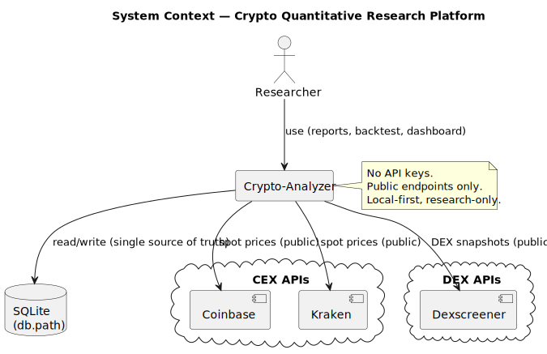
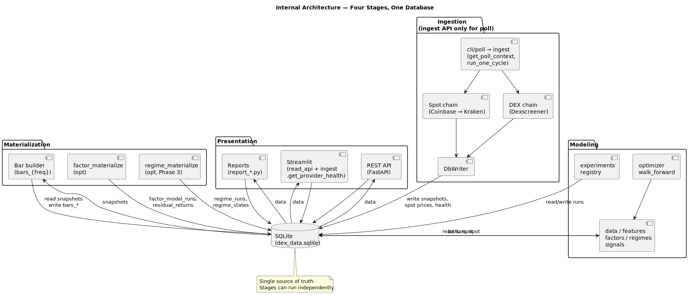
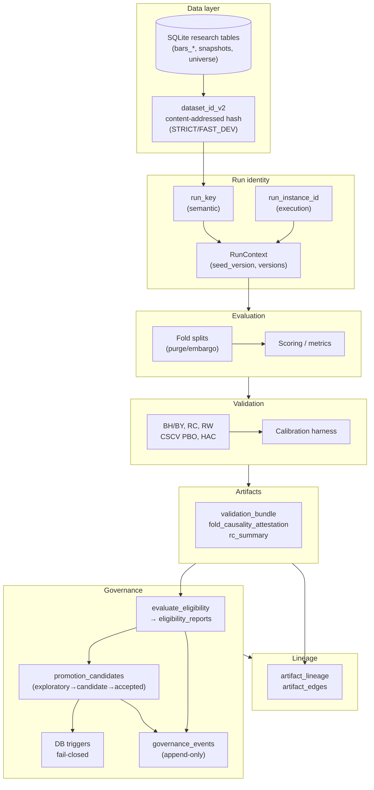

# Crypto-Anaylzer — Deterministic Research Validation Control Plane

[](https://www.python.org/)
[](LICENSE)
[](#development--verification)

A local-first **research validation control plane** for crypto: it enforces deterministic dataset identity, run identity, fold causality, and fail-closed promotion so that only attested, reproducible results can be promoted. Governance and auditability are enforced at the DB and gatekeeper layers. No API keys, no trading — validation and reports only.

**Who this is for**

- Researchers who need reproducible validation and promotion gates
- Research platform / quant infra engineers who need auditability and determinism

<p align="center">
  
</p>
<p align="center"><sup><a href="docs/diagrams/README.md">All diagrams</a></sup></p>

**What this is (in six bullets):**

- **Validation control plane** — Governs whether a research result is eligible for promotion (candidate/accepted). Does not execute or trade.
- **Content-addressed datasets** — `dataset_id_v2` hashes logical content of allowlisted SQLite tables; one row change changes the id. STRICT mode required for promotion.
- **Deterministic run identity** — `run_key` (semantic) and `run_instance_id` (execution); seeds derived from run_key + salt + version; same config + dataset → same run_key.
- **Fold-causality enforcement** — Purge/embargo in walk-forward splits; train-only fit; attestation artifact required for candidate/accepted when walk-forward is used.
- **Fail-closed promotion** — Candidate and accepted require a passing eligibility report; DB triggers block promotion without it; referenced eligibility reports are immutable.
- **Append-only governance and lineage** — `governance_events`, `artifact_lineage`, and `artifact_edges` are append-only; audit trace from accepted → inputs/configs/artifacts.

---

### Reading paths

| If you want to… | Read this |
|-----------------|-----------|
| **Quickstart (5 minutes)** | [Quickstart](#quickstart) → venv, install, minimal report path. |
| **For researchers** | [Trust model in practice](#trust-model-in-practice), [Key guarantees](#key-guarantees-phase-1-35), [Core workflows](#core-workflows), [Determinism & reproducibility](#determinism--reproducibility). |
| **For engineers** | [Architecture at a glance](#architecture-at-a-glance), [CLI cheatsheet](#cli-cheatsheet), [Development / Verification](#development--verification). |
| **For reviewers** | [Trust model in practice](#trust-model-in-practice), [Promotion model](#promotion-model), [Auditability](#auditability-story), [Methods & limits](docs/methods_and_limits.md), [References](#references). |

---

## Quickstart

Prerequisites: Python 3.10+. No API keys (public endpoints only).

```powershell
git clone https://github.com/AlpharomeroJL/Crypto-Anaylzer.git
cd Crypto-Anaylzer
python -m venv .venv
.venv\Scripts\activate
pip install -r requirements.txt
```

Minimal path to a research report:

```powershell
.\scripts\run.ps1 doctor
.\scripts\run.ps1 universe-poll --universe --universe-chain solana --interval 60
.\scripts\run.ps1 materialize --freq 1h
.\scripts\run.ps1 reportv2 --freq 1h --out-dir reports --hypothesis "baseline momentum"
```

One-command demo (preflight + poll + materialize + report): `.\scripts\run.ps1 demo`

---

### Trust model in practice

- **Boundaries** — CI enforces import/boundary rules so that execution, broker, and CLI layers cannot be part of the research control plane (core/governance). See [Validation control plane audit](docs/audit/validation_control_plane.md).
- **Reproducibility** — Content-addressed datasets, deterministic run identity, and seeded RNG; promotion requires STRICT dataset hash and provenance. See [Determinism & reproducibility](#determinism--reproducibility) and [Key guarantees](#key-guarantees-phase-1-35) below.
- **Fold causality** — Purge/embargo and train-only fit are enforced; attestation is required for candidate/accepted when walk-forward is used. See [Key guarantees](#key-guarantees-phase-1-35) below and [Methods & Limits](docs/methods_and_limits.md).

### Key guarantees (Phase 1–3.5)

- **dataset_id_v2** — Content-addressed hashing of allowlisted tables (canonical ordering); STRICT for promotion.
- **run_key + run_instance_id** — Semantic run identity and execution instance; run_key excludes timestamps/paths.
- **Deterministic RNG** — `seed_root(run_key, salt, version)`; salted, reproducible across processes; `seed_version` in artifacts.
- **Calibration harness** — BH/BY, RC, RW, CSCV PBO, bootstrap, HAC: CI-safe Type I (and FDR/RC/RW) checks; guards, not full statistical certification.
- **Fold-causality + attestation** — Purge/embargo, train-only fit; attestation artifact with schema version; gatekeeper requires valid attestation when walk-forward used.
- **Fail-closed promotion** — Eligibility reports + DB triggers; no candidate/accepted without linked passing report at same level; evidence immutable when referenced.
- **Append-only governance_events** — All evaluate/promote actions logged; no updates or deletes.
- **artifact_lineage + artifact_edges** — Audit graph from accepted → run → configs/versions/artifacts.
- **SQLite authoritative** — Single source of truth for governance and lineage; optional DuckDB analytics backend (read-only for governance).

### Design rationale

**Why deterministic IDs?** So every run is traceable and repeatable: same inputs and config produce the same `dataset_id_v2`, `run_key`, and artifact hashes. That lets you compare runs, invalidate caches when data changes, and prove reproducibility in audits. **Why opt-in migrations?** Phase 3 (regimes, promotion, lineage) adds schema and behavior that not every user needs. **Why governance modeling?** Research that moves toward production needs a path from “exploratory” to “accepted” with clear gates (eligibility reports, fold attestation, RC/RW when enabled) and an append-only audit log.

---

## Research rigor & overfitting defenses

Signal discovery is treated as a **multiple-testing problem under dependence**. Key controls: walk-forward (purge/embargo, train-only fit, fold-causality attestation); deflated Sharpe with Neff; PBO-style/CSCV; BH/BY; optional Reality Check and Romano–Wolf; HAC mean inference. **Details:** [Methods & Limits](docs/methods_and_limits.md), [Statistical Methods Appendix](docs/appendix/statistical_methods.md), [implementation-aligned formulae](docs/appendix/methods_limits_implementation.md).

---

## Architecture at a glance

<p align="center">
  
</p>



Full diagram source: [docs/architecture/validation_control_plane.mmd](docs/architecture/validation_control_plane.mmd).

---

## Core workflows

1. **Ingest** — Poll writes to `spot_price_snapshots`, `sol_monitor_snapshots`, universe tables. `run_migrations` applies core + v2 factor tables.
2. **Bars** — Raw snapshots → deterministic OHLCV bars (5min, 15min, 1h, 1D). Idempotent.
3. **Factors** — Rolling OLS (or optional Kalman) vs BTC/ETH → residual returns. Materialized to `factor_model_runs`, `factor_betas`, `residual_returns`; identified by `dataset_id` and `factor_run_id`.
4. **Signals** — Cross-sectional factors; winsorized z-scores; signal panels.
5. **Validation** — IC, IC decay; per-signal ValidationBundle (paths, metrics). Fold causality: purge/embargo, attestation when walk-forward used.
6. **Corrections** — Deflated Sharpe, PBO proxy, block bootstrap, BH/BY; optional Reality Check (reportv2 `--reality-check`, `family_id`).
7. **Reporting** — reportv2; optional regime-conditioned IC with `--regimes REGIME_RUN_ID`; Streamlit dashboard; experiment registry; manifests. **Promotion** — Create candidate; evaluate eligibility; promote to candidate/accepted via governance entrypoint; all actions logged to `governance_events`.

---

## CLI cheatsheet

All commands: `.\scripts\run.ps1 <command> [args...]`

| Command | Description |
|---------|-------------|
| `doctor` | Preflight: environment, DB schema, pipeline smoke test |
| `poll` | Single-pair data poll (provider fallback) |
| `universe-poll --universe ...` | Multi-asset universe discovery (e.g. `--universe-chain solana`) |
| `materialize` | Build OHLCV bars (e.g. `--freq 1h`) |
| `reportv2` | Research report: IC, PBO, QP; optional `--regimes`, `--reality-check`, `--execution-evidence` when Phase 3 enabled |
| `walkforward` | Walk-forward backtest, out-of-sample fold stitching |
| `promotion` | Promotion subcommands: list, create, evaluate |
| `verify` | Full gate: doctor → pytest → ruff → research-only boundary → diagram export |
| `test` | Run pytest |
| `streamlit` | Interactive dashboard |
| `demo` | One-command demo: doctor → poll → materialize → report |
| `check-dataset` | Inspect dataset fingerprints and row counts |

---

## Promotion model

- **exploratory** — No gate; warnings only.
- **candidate** — Requires passing `evaluate_eligibility(..., level="candidate")`: STRICT dataset_id_v2, run_key, engine_version, config_version, seed_version; fold attestation when walk-forward used; RC/RW contract when enabled. Result stored in `eligibility_reports`; DB trigger blocks status without linked passing report.
- **accepted** — Same fail-closed requirement at level `accepted`; eligibility_report_id and report level must match status.

Walk-forward runs require a valid fold-causality attestation (schema version, purge_applied, embargo_applied, train_only_fit_enforced) for candidate/accepted.

---

## Auditability story

How to trace an accepted result (without reading report files):

1. **promotion_candidates** — Filter `status = 'accepted'`; get `candidate_id`, `eligibility_report_id`.
2. **eligibility_reports** — Join on `eligibility_report_id`; get `run_key`, `run_instance_id`, `dataset_id_v2`, `passed`, `level`, `blockers_json`, `computed_at_utc`.
3. **governance_events** — Filter by `candidate_id`; order by `event_id`; see sequence of evaluate/promote and actors.
4. **artifact_lineage** — Filter by `run_key` or `run_instance_id`; get `artifact_id`, `artifact_type`, `sha256`, `created_utc` for that run.
5. **artifact_edges** — Join on `child_artifact_id` / `parent_artifact_id` to walk graph (e.g. validation_bundle → fold_causality_attestation, rc_summary).
6. **Versions** — From eligibility report or artifact_lineage: `engine_version`, `config_version`, `dataset_id_v2`; from bundle meta or attestation: `seed_version`, schema versions.

---

## Determinism & reproducibility

| ID or mechanism | What it keys |
|-----------------|--------------|
| **dataset_id_v2** | Content-addressed hash of allowlisted tables (logical content, canonical ordering). STRICT for promotion. |
| **run_key** | Deterministic hash of semantic payload (dataset_id_v2, config, versions); excludes timestamps/paths. |
| **run_instance_id** | Execution instance (e.g. manifest run_id); same run_key can have many instances. |
| **factor_run_id** | Hash of dataset_id + factor config (freq, window, estimator). |
| **family_id** | Reality Check family (signal×horizon); used in RC cache and promotion gating. |
| **Artifact SHA256** | File hashes for validation bundles and outputs; deterministic rerun test compares bundle and manifest bytes. |
| **CRYPTO_ANALYZER_DETERMINISTIC_TIME** | Fixes timestamps so materialize and reportv2 produce identical outputs on rerun. Intended for deterministic rerun testing; does not change promotion eligibility gates (STRICT dataset hash and provenance still required). |
| **Bootstrap / RC seed** | Derived via `seed_root(run_key, salt, version)`; seed_version in artifacts; reproducible null distributions and CIs. |

---

## Development / Verification

Exact commands (PowerShell). Run from repo root with venv activated (e.g. `.venv\Scripts\activate`).

### Tier 1: Fast checks

```powershell
python -m ruff check .
python -m ruff format .
python -m pytest -m "not slow" -q --tb=short
```

- **ruff:** All checks passed.
- **pytest -m "not slow":** Skips tests marked `@pytest.mark.slow` (full report pipeline). Typical runtime under a few minutes. See `pyproject.toml` for the `slow` marker.

### Tier 2: Phase-specific targeted suites

Tier 2 lists common debug targets. The canonical gate is Tier 1 + `.\scripts\run.ps1 verify`. If filenames change, use `ls tests/test_*` (or equivalent) to locate the current modules.

**Dataset v2 and run identity:**

```powershell
python -m pytest tests/test_dataset_v2.py tests/test_run_identity.py tests/test_backfill_dataset_v2.py -v --tb=short
```

**RNG and bootstrap:**

```powershell
python -m pytest tests/test_statistics_research.py -v --tb=short
```

**Calibration (BH/BY, RC, RW, CSCV, Type I) — smoke:**

```powershell
python -m pytest tests/test_calibration_fdr_smoke.py tests/test_calibration_cscv_smoke.py tests/test_calibration_rc_smoke.py tests/test_calibration_rw_smoke.py tests/test_calibration_harness_type1.py -v --tb=short
```

**Fold causality and attestation:**

```powershell
python -m pytest tests/test_fold_causality_attestation.py tests/test_promotion_requires_fold_causality_attestation.py tests/test_transform_fit_called_only_on_train.py -v --tb=short
```

**Promotion gating and eligibility:**

```powershell
python -m pytest tests/test_promotion_gating.py tests/test_gatekeeper_requires_versions_and_seed_version.py tests/test_promotion_service.py tests/test_audit_invariants_fail_closed.py -v --tb=short
```

**Phase 3 migrations and governance:**

```powershell
python -m pytest tests/test_migrations_phase3.py tests/test_governance_event_log_append_only.py tests/test_artifact_lineage_append_only.py tests/test_artifact_lineage_written.py tests/test_acceptance_audit_trace.py -v --tb=short
```

**Determinism and Reality Check:**

```powershell
python -m pytest tests/test_reportv2_deterministic_rerun.py tests/test_research_pipeline_smoke.py tests/test_reality_check_null_sanity.py -v --tb=short
```

*(Optional: DuckDB backend tests require DuckDB; skip if not installed.)*

### Tier 3: Full test suite

```powershell
python -m pytest -q --tb=short
```

**Full verification script** (doctor → pytest → ruff → research-only boundary → diagram export):

```powershell
.\scripts\run.ps1 verify
```

### Docs formatting

Some docs include Mermaid diagrams and math. To normalize for GitHub (fenced Mermaid, `$...$` / `$$...$$` math):

```powershell
python scripts/normalize_markdown_math.py
```

To check only: `python scripts/normalize_markdown_math.py --check`

---

## References

Canonical references for the statistical and econometric methods used in the validation stack:

- **Deflated Sharpe Ratio (DSR) / effective trials (Neff):** Bailey, D., & López de Prado, M. (2014). The Deflated Sharpe Ratio. *Journal of Portfolio Management*, 40(5), 94–107.
- **Benjamini–Hochberg (BH):** Benjamini, Y., & Hochberg, Y. (1995). Controlling the False Discovery Rate: A Practical and Powerful Approach to Multiple Testing. *Journal of the Royal Statistical Society B*, 57(1), 289–300.
- **Benjamini–Yekutieli (BY):** Benjamini, Y., & Yekutieli, D. (2001). The Control of the False Discovery Rate in Multiple Testing Under Dependency. *Annals of Statistics*, 29(4), 1165–1188.
- **White's Reality Check:** White, H. (2000). A Reality Check for Data Snooping. *Econometrica*, 68(5), 1097–1126.
- **Romano–Wolf stepdown:** Romano, J. P., & Wolf, M. (2005). Stepwise Multiple Testing as Formalized Data Snooping. *Econometrica*, 73(4), 1237–1282.
- **CSCV / PBO (Bailey et al.):** Bailey, D. H., Borwein, J., López de Prado, M., & Zhu, Q. J. (2014). Pseudo-Mathematics and Financial Charlatanism: The Effects of Backtest Overfitting on Out-of-Sample Performance. *Notices of the AMS*, 61(5), 458–471.
- **Stationary bootstrap (Politis & Romano):** Politis, D. N., & Romano, J. P. (1994). The Stationary Bootstrap. *Journal of the American Statistical Association*, 89(428), 1303–1313.
- **Newey–West / HAC:** Newey, W. K., & West, K. D. (1987). A Simple, Positive Semi-Definite, Heteroskedasticity and Autocorrelation Consistent Covariance Matrix. *Econometrica*, 55(3), 703–708.

Short form and artifact keys: [Methods & limits](docs/methods_and_limits.md) (§19). Formal definitions: [Statistical Methods Appendix](docs/appendix/statistical_methods.md). Repo formulae: [implementation-aligned](docs/appendix/methods_limits_implementation.md).

---

## Limitations

- **Single-node, local-first** — Not distributed; one SQLite DB per environment.
- **Not a multi-user concurrent platform** — No built-in concurrency control for concurrent promotion or lineage writes.
- **Research validation only** — No execution, order routing, or live trading.
- **Calibration harness** — CI-safe guards (Type I, FDR, RC, RW, CSCV, bootstrap); not full statistical certification under all data-generating processes.
- **Scalability** — SQLite is the single store; suitable for research and moderate history. Optional DuckDB for read-heavy analytics; governance and lineage remain in SQLite.
- **Data scope:** Ingestion is public CEX/DEX only; no authenticated feeds. No real-time execution or order routing.

---

## Repository map

| Directory / module | Purpose |
|--------------------|---------|
| **crypto_analyzer/core/** | RunContext, run identity (`run_identity.py`), context |
| **crypto_analyzer/dataset_v2.py** | dataset_id_v2 hashing, backfill |
| **crypto_analyzer/fold_causality/** | Folds, purge/embargo, attestation, runner |
| **crypto_analyzer/governance/** | promote, audit, audit_invariants |
| **crypto_analyzer/promotion/** | gating (evaluate_eligibility), service, store_sqlite |
| **crypto_analyzer/db/** | migrations_phase3, lineage, governance_events |
| **crypto_analyzer/store/** | sqlite_backend, duckdb_backend (lineage → SQLite) |
| **crypto_analyzer/rng.py** | seed_root, salts, SEED_ROOT_VERSION |
| **crypto_analyzer/stats/** | reality_check, calibration_*, multiple_testing |
| **crypto_analyzer/contracts/** | validation_bundle_contract, schema_versions |
| **cli/** | research_report_v2, poll, materialize, promotion |
| **tests/** | test_dataset_v2, test_run_identity, test_promotion_*, test_artifact_lineage_*, etc. |
| **docs/audit/** | validation_control_plane.md, phase1_verification.md |
| **docs/architecture/** | validation_control_plane.mmd |
| **docs/spec/** | system_overview, stats_stack_upgrade_acceptance |
| **scripts/** | run.ps1, export_diagrams.ps1 |

---

## Documentation index

| Document | Contents |
|----------|----------|
| [Methods & limits](docs/methods_and_limits.md) | Statistical methods, assumptions, artifact keys, limitations (DSR, PBO, BH/BY, RC, RW, HAC, breaks, capacity). See: [Statistical Methods Appendix](docs/appendix/statistical_methods.md). |
| [Stats stack acceptance](docs/spec/stats_stack_upgrade_acceptance.md) | Definition of done for upgrades #1–#6; exact artifact keys; minimum data thresholds; golden run command. |
| [Statistical Methods Appendix](docs/appendix/statistical_methods.md) | Formal definitions, assumptions, derivations/proof sketches for DSR, PBO, BH/BY, bootstrap, Reality Check, HAC (Appendices A & B). |
| [Methods & Limits — implementation-aligned](docs/appendix/methods_limits_implementation.md) | Exact repo formulae: DSR, Neff, PBO proxy + CSCV PBO, BH/BY, bootstrap, RC, Romano–Wolf, HAC, break diagnostics, capacity curve. |
| [Validation control plane audit](docs/audit/validation_control_plane.md) | Threat model, design, governance, reproducibility, gaps. |
| [Phase 3 summary](docs/phase3_summary.md) | Phase 3 migrations, governance, lineage, store. |
| [Phase 1 verification](docs/audit/phase1_verification.md) | Phase 1 verification checklist (dataset_id_v2, run_key, backfill). |
| [Research validation workflow](docs/research_validation_workflow.md) | Exploratory vs full-scale runs, run_id, snapshot semantics, validation readiness criteria. |
| [Spec index (canonical)](docs/spec/README.md) | Master spec, system overview, implementation ledger, component specs. |
| [System overview](docs/spec/system_overview.md) | Pipeline lifecycle, determinism, statistical stack, feature flags, promotion. |
| [Implementation ledger](docs/spec/implementation_ledger.md) | Requirement → status, PRs, evidence. |
| [Design](docs/design.md) | Data flow, provider contracts, failure modes. |
| [Architecture](docs/architecture.md) | Module responsibility matrix. |
| [Contributing](CONTRIBUTING.md) | Dev setup, testing, style, adding providers, verify. |
| [Diagrams](docs/diagrams/README.md) | PlantUML index and export. |
| [Audit notes](docs/audit/README.md) | Architecture audits and alignment reports. |

---

## Release / Verification status

- [Validation control plane audit](docs/audit/validation_control_plane.md)
- [Phase 3 summary](docs/phase3_summary.md)
- [Phase 1 verification](docs/audit/phase1_verification.md)

---

## Troubleshooting

| Problem | Solution |
|---------|----------|
| No data in dashboard | Run `poll` (or universe-poll) then `materialize`. |
| Bars table not found | Run `.\scripts\run.ps1 materialize --freq 1h`. |
| Provider DOWN | Circuit breaker; auto-recovers after cooldown. |
| reportv2 --regimes fails | Set `CRYPTO_ANALYZER_ENABLE_REGIMES=1`, run Phase 3 migrations, then regime materialize. |
| Verify fails | Run `doctor`; ensure venv active; fix ruff/pytest as indicated. |

---

## License and disclaimer

MIT License. See [LICENSE](LICENSE).

**Research-only.** This tool analyzes data and produces reports. It does not execute trades, hold API keys, or connect to any broker. Opt-in features (regimes, Phase 3 migrations, Reality Check, promotion) do not change default behavior.
