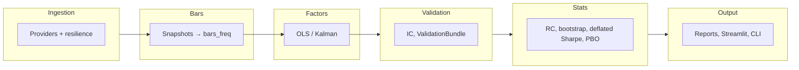

# Crypto-Analyzer  
## Deterministic Crypto Research Platform

[](https://www.python.org/)
[](LICENSE)
[](#development--verification)

A local-first research platform for crypto markets: **ingest** from public CEX/DEX APIs into one SQLite database, **materialize** bars and factors, then **validate** signals and run walk-forward backtests with overfitting controls. No API keys, no trading — analysis and reports only.

<p align="center">
  
</p>
<p align="center"><sup><a href="docs/diagrams/README.md">All diagrams</a></sup></p>

**What this is (in four bullets):**

- **Single SQLite source of truth** — All data, bars, factor runs, and (when opted in) regime and promotion state live in one database. No cloud, no vendor lock-in.
- **Versioned migrations** — Core and factor tables via `run_migrations`; Phase 3 (regimes, promotion) via `run_migrations_phase3` only when you enable it. Default behavior is unchanged.
- **Statistical defenses** — Walk-forward splits; block bootstrap; deflated Sharpe with effective-trials (Neff) audit; PBO proxy and CSCV PBO; multiple-testing (BH/BY); optional Reality Check (max-statistic bootstrap) and Romano–Wolf stepdown; HAC mean inference; structural break diagnostics (CUSUM + sup-Chow); capacity curve with participation-based impact and execution evidence. Full stack and artifact keys: [Methods & Limits](docs/methods_and_limits.md) and [Stats stack acceptance](docs/spec/stats_stack_upgrade_acceptance.md).
- **Governance and reproducibility** — Deterministic run IDs (`dataset_id`, `factor_run_id`, `regime_run_id`, `family_id`), artifact hashes, optional promotion workflow (exploratory → candidate → accepted) with audit log.

---

### Reading paths

| If you want to… | Read this |
|-----------------|-----------|
| **Quickstart (5 minutes)** | [Quickstart](#quickstart) → run a few commands and generate a report. |
| **For researchers** | [Why it’s trustworthy](#why-its-trustworthy), [Core workflows](#core-workflows), [Determinism & reproducibility](#determinism--reproducibility). |
| **For engineers** | [Architecture at a glance](#architecture-at-a-glance), [CLI cheatsheet](#cli-cheatsheet), [Development / Verification](#development--verification). |
| **For reviewers** | [Why it’s trustworthy](#why-its-trustworthy), [Statistical defenses](#why-its-trustworthy), [Methods & limits](docs/methods_and_limits.md), and [Determinism](#determinism--reproducibility); then [docs/spec/system_overview.md](docs/spec/system_overview.md). |

---

## Quickstart

Prerequisites: Python 3.10+. No API keys (public endpoints only).

```powershell
git clone https://github.com/AlpharomeroJL/Crypto-Anaylzer.git && cd Crypto-Anaylzer
python -m venv .venv
.venv\Scripts\activate
pip install -r requirements.txt
```

Minimal path to a research report:

```powershell
.\scripts\run.ps1 doctor
.\scripts\run.ps1 universe-poll --universe --universe-chain solana --interval 60
.\scripts\run.ps1 materialize --freq 1h
.\scripts\run.ps1 reportv2 --freq 1h --out-dir reports --hypothesis "baseline momentum"
```

One-command demo (preflight + poll + materialize + report): `.\scripts\run.ps1 demo`

---

## Why it’s trustworthy

- **Leakage controls** — Causal factor residuals (no future data); strict train/test separation in walk-forward; research-only boundary check in CI (no order/submit/broker or API keys in code).
- **Reproducibility** — Stable IDs for dataset, factor run, regime run, and Reality Check family; fixed seeds for bootstrap and Reality Check; optional `CRYPTO_ANALYZER_DETERMINISTIC_TIME` so materialize and reportv2 produce identical outputs on rerun.
- **Statistical defenses** — Walk-forward splits; block bootstrap (seeded, preserves serial correlation); deflated Sharpe with Neff (effective trials) when `--n-trials auto`; PBO proxy and CSCV PBO; multiple-testing (BH/BY); optional Reality Check (bootstrap-based null, keyed by `family_id`) and Romano–Wolf stepdown when enabled; HAC mean inference (with skip when n &lt; 30); structural break diagnostics (CUSUM + sup-Chow); capacity curve (participation-based impact) and execution evidence. See [Methods & Limits](docs/methods_and_limits.md) and [Stats stack acceptance](docs/spec/stats_stack_upgrade_acceptance.md).

### Methods & limits (formal)

The statistical controls in this repo are designed to reduce false discoveries and make overfitting visible—*not* to guarantee profitability.

**Statistical stack (canonical list):** Neff/DSR (effective trials + deflated Sharpe), BH/BY (FDR control), RC + Romano–Wolf (optional, data-snooping correction), HAC mean inference, PBO proxy + CSCV PBO, structural break diagnostics (CUSUM + sup-Chow), capacity curve (participation-based impact) and execution evidence. Full narrative and artifact keys: [Methods & Limits](docs/methods_and_limits.md), [implementation appendix](docs/appendix/methods_limits_implementation.md), [Stats stack acceptance](docs/spec/stats_stack_upgrade_acceptance.md).

**Implemented controls (what we actually compute):**

- **Walk-forward** train/test splits (OOS metrics only).
- **Bootstrap under dependence** (fixed block + stationary bootstrap; seeded; preserves serial correlation) for uncertainty estimates and null generation.
- **Deflated Sharpe (repo implementation):** Sharpe deflation using skew/excess-kurtosis-adjusted Sharpe variance and a leading-order extreme-value correction over an estimated trials count $N$.
- **PBO:** Walk-forward PBO proxy (median underperformance rate) plus optional CSCV PBO (combinatorially symmetric cross-validation; skipped when T &lt; S×4 or J &lt; 2, with reason in artifacts).
- **Multiple testing control:** BH/BY adjusted p-values for signal discovery.
- **Reality Check (optional):** max-statistic bootstrap test for data-snooping control keyed by `family_id`. **Romano–Wolf stepdown** (optional, env flag): maxT stepdown adjusted p-values; `rw_adjusted_p_values` present in RC summary when enabled.
- **HAC mean inference:** Newey–West LRV for mean return/IC; t and p reported when n ≥ 30; otherwise `hac_skipped_reason` and null t/p.
- **Structural break diagnostics:** CUSUM mean-shift (HAC-calibrated) and sup-Chow single-break scan; `break_diagnostics.json`; skip reasons and `estimated_break_date` (UTC→naive ISO).
- **Capacity curve:** Participation-based impact (or power-law fallback), required columns `notional_multiplier`, `sharpe_annual`; additive audit columns; `non_monotone_capacity_curve_observed` flag when Sharpe increases with size.

**Assumptions & known limits (read before citing results):**

- Deflated Sharpe and the PBO proxy rely on simplifying assumptions and are best treated as *screening statistics*.
- BH assumes independence/positive dependence; BY is dependence-robust but more conservative.
- Bootstrap methods assume weak stationarity within the sampled windows; regime breaks can invalidate calibration.

**Formal definitions + derivations:**

- [Methods & Limits](docs/methods_and_limits.md) — philosophy, assumptions, implementation boundaries, and artifact keys (Neff, HAC, RC/RW, CSCV, breaks, capacity).
- [Statistical Methods Appendix](docs/appendix/statistical_methods.md) — formal definitions and proof sketches (Appendices A & B).
- [Methods & Limits — implementation-aligned](docs/appendix/methods_limits_implementation.md) — exact repo formulae for DSR, BH/BY, PBO proxy and CSCV PBO, bootstrap, Reality Check, Romano–Wolf, HAC, break diagnostics, capacity curve.
- [Stats stack upgrade acceptance](docs/spec/stats_stack_upgrade_acceptance.md) — definition of done per upgrade (#1–#6), artifact keys, and golden run command.

- **Single source of truth** — One SQLite DB; versioned, idempotent migrations (`run_migrations` for core + v2; `run_migrations_phase3` opt-in only). Ingestion uses the ingest API (writes, migrations, provider chains); dashboard uses read-only `read_api`. No test performs live HTTP; all research tests use mocked HTTP and are deterministic where applicable.

---

### Design rationale

**Why deterministic IDs?** So every run is traceable and repeatable: same inputs and config produce the same `dataset_id`, `factor_run_id`, and artifact hashes. That lets you compare runs, invalidate caches when data changes, and prove reproducibility in audits or reviews. **Why opt-in migrations?** Phase 3 (regimes, promotion, sweep tables) adds schema and behavior that not every user needs. Keeping it opt-in preserves a minimal default: one DB, core + factor tables, no extra complexity until you enable it. **Why governance modeling?** Research that moves toward production needs a path from “exploratory” to “accepted” with clear gates (IC, Reality Check, execution evidence) and an audit log. The promotion workflow and ValidationBundle give you that without forcing it on single-run or ad-hoc use.

---

## Research rigor & overfitting defenses

This repo treats signal discovery as a **multiple-testing problem under dependence**. Key controls:

- Walk-forward evaluation
- Deflated Sharpe Ratio (DSR-style)
- Probability of Backtest Overfitting (PBO-style)
- False Discovery Rate control (BH/BY)
- Stationary bootstrap confidence intervals

**Details:**

- [Statistical Methods Appendix](docs/appendix/statistical_methods.md) — formal definitions and assumptions (Appendix A)
- [Derivations & proof sketches](docs/appendix/statistical_methods.md#appendix-b--derivations-and-asymptotic-results-proof-sketches) — asymptotics, delta method, DSR construction, BH/BY and bootstrap (Appendix B)

---

## Architecture at a glance

<p align="center">
  
</p>



- **Stages:** Ingest (provider chains, retry/backoff, circuit breakers, last-known-good cache) → Bars (deterministic OHLCV) → Factors (rolling OLS or optional Kalman; `factor_run_id`) → Signals → Validation (IC, decay, per-signal ValidationBundle) → Statistical corrections → Reporting / UI. Optional: Regime models (opt-in); Reality Check (opt-in); Promotion workflow (opt-in).
- **Ingest vs read_api:** Poll and migrations use `crypto_analyzer.ingest`; dashboard and health use `read_api` only.
- **Phase 3 (opt-in):** Set `CRYPTO_ANALYZER_ENABLE_REGIMES=1` and run `run_migrations_phase3` for regime_runs, regime_states, promotion_candidates, promotion_events, sweep tables. Default `run_migrations()` does not apply Phase 3.

Full pipeline and contracts: [docs/spec/system_overview.md](docs/spec/system_overview.md). More architecture diagrams: [docs/diagrams](docs/diagrams/README.md).

---

## Core workflows

1. **Ingest** — Poll writes to `spot_price_snapshots`, `sol_monitor_snapshots`, `provider_health`, universe tables. `run_migrations` applies core + v2 factor tables when opening the DB.
2. **Bars** — Raw snapshots → deterministic OHLCV bars (5min, 15min, 1h, 1D). Idempotent.
3. **Factors** — Rolling OLS (or optional Kalman) vs BTC/ETH → residual returns. Materialized to `factor_model_runs`, `factor_betas`, `residual_returns`; identified by `dataset_id` and `factor_run_id`.
4. **Signals** — Cross-sectional factors (size, volume, momentum); winsorized z-scores; signal panels.
5. **Validation** — IC, IC decay, orthogonalization; per-signal ValidationBundle (paths, metrics).
6. **Corrections** — Deflated Sharpe, PBO proxy, block bootstrap, BH/BY; optional Reality Check (reportv2 `--reality-check`, `family_id`).
7. **Reporting** — reportv2 (and optional regime-conditioned IC with `--regimes REGIME_RUN_ID` when regimes enabled); Streamlit dashboard; experiment registry; manifests.

**Opt-in:**

- **Regimes** — `CRYPTO_ANALYZER_ENABLE_REGIMES=1`, then `run_migrations_phase3` and regime materialize. reportv2 `--regimes REGIME_RUN_ID` for regime-conditioned summaries. Regime logic lives in `crypto_analyzer/regimes/` (e.g. RegimeDetector, legacy classify).
- **Reality Check** — reportv2 `--reality-check`; RC null cache keyed by `family_id` + config + dataset + git.
- **Promotion workflow** — Create candidate (CLI `promotion create` or Streamlit); evaluate (IC, t-stat, BH-adjusted p-value, optional regime robustness, RC, execution evidence); append-only audit in `promotion_events`. See [docs/spec/system_overview.md](docs/spec/system_overview.md).

---

## CLI cheatsheet

All commands: `.\scripts\run.ps1 <command> [args...]`

| Command | Description |
|---------|-------------|
| `doctor` | Preflight: environment, DB schema, pipeline smoke test |
| `poll` | Single-pair data poll (provider fallback) |
| `universe-poll --universe ...` | Multi-asset universe discovery (e.g. `--universe-chain solana`) |
| `materialize` | Build OHLCV bars (e.g. `--freq 1h`) |
| `import_birdeye_history` | Import Birdeye historical pool data into a temp DB copy (see [Birdeye import](docs/birdeye_import.md)) |
| `import_geckoterminal_history` | Import GeckoTerminal historical pool data (free, no API key; see [GeckoTerminal import](docs/geckoterminal_import.md)) |
| `reportv2` | Research report: IC, orthogonalization, PBO, QP; optional `--regimes`, `--reality-check`, `--execution-evidence` when Phase 3 enabled |
| `walkforward` | Walk-forward backtest, out-of-sample fold stitching |
| `null_suite` | Null/placebo runner (random ranks, permuted signal, block shuffle) |
| `promotion` | Promotion subcommands: list, create, evaluate (opt-in) |
| `verify` | Full gate: doctor → pytest → ruff → research-only boundary → diagram export |
| `test` | Run pytest |
| `streamlit` | Interactive dashboard (12 pages) |
| `demo` | One-command demo: doctor → poll → materialize → report |
| `check-dataset` | Inspect dataset fingerprints and row counts |

**Historical import:** [Birdeye](docs/birdeye_import.md) (API key) or [GeckoTerminal](docs/geckoterminal_import.md) (free, no key) can backfill Solana pool history into a temp DB; then materialize and run case_study_liqshock against it. Multichain (discover → probe → select → import): [Gecko multichain workflow](docs/gecko_multichain_workflow.md).

### Expanded-Universe Validation Workflow (case-study liqshock)

For **expanded-universe validation** (DEX-only, enough cross-section for finite Sharpes, raw p-values, and BH survivors), follow this runbook. Pipeline is unchanged; you expand **data** (pairs + history) then run exploratory validation runs and, when ready, a full-scale validation run. See [Research validation workflow](docs/research_validation_workflow.md) for concepts (run_id, snapshot vs working packet) and typical workflows.

**Operational checklist (copy-paste)**  
1. Make sure polling is running in universe mode for Solana with broad queries (USDC/USDT + ecosystem), page_size high enough to discover ≥25 pairs; keep it running continuously.  
2. Every N hours (e.g. 6–24h), run `.\scripts\run.ps1 materialize --freq 1h --no-snapshot-filters`.  
3. After materialize, run an **exploratory validation run** (no `--snapshot`; keep RC low). Early in ramp: `--min-bars 25` (or omit); at ~10–20 days per pair use `--min-bars 500`; later `--min-bars 1000`. Confirm diagnostics: returns columns, bars unique pair_ids, date ranges, bars matched.  
4. When diagnostics meet [validation readiness criteria](docs/research_validation_workflow.md#validation-readiness-criteria) (e.g. ≥25 pairs, ≥180d history), run a **full-scale validation run**: `.\scripts\run.ps1 case_study_liqshock --freq 1h --dex-only --min-bars 1000 --rc-n-sim 1000 --rc-method stationary --rc-avg-block-length 24 --snapshot`.  
5. The **snapshot folder** `reports\case_study_liqshock_runs\<run_id>\` is an immutable research snapshot (created with `--snapshot`; never overwritten). `reports\case_study_liqshock_latest` is the mutable working packet (overwritten each run).

**Operational next steps (exactly what to do now)**  
- **Keep universe-poll running** so the new pairs (e.g. 6) accumulate snapshots.  
- **Run materialize repeatedly** (every few hours):  
  `.\scripts\run.ps1 materialize --freq 1h --no-snapshot-filters`  
- **Keep exploratory validation cheap and aligned to warmup:**  
  - **Early ramp:** `--min-bars 25` (or omit) until you have depth.  
  - **~10–20 days per pair:** switch to `--min-bars 500`.  
  - **Later:** `--min-bars 1000`.  
- **After each materialize**, run:  
  `.\scripts\run.ps1 case_study_liqshock --freq 1h --dex-only --min-bars 25 --rc-n-sim 50 --rc-method stationary --rc-avg-block-length 24`  
- **Watch:** bars unique pair_ids, bars date range.

**A) Expand pairs (universe discovery)**  
Universe mode discovers multi-asset DEX pairs from Dexscreener. Config: [config.yaml](config.yaml) `universe` (queries, page_size, min_liquidity_usd, min_vol_h24). CLI overrides: `--universe-page-size`, `--universe-query`, `--universe-min-liquidity`, `--universe-min-vol-h24`, etc.

- **Baseline** (run continuously on your chain):

```powershell
.\scripts\run.ps1 universe-poll --universe --universe-chain solana --interval 60
```

- **First try for ≥25 pairs** (page_size 80 + multi-query: stables + ecosystem + venue):

```powershell
.\scripts\run.ps1 universe-poll --universe --universe-chain solana --interval 60 --universe-page-size 80 --universe-query USDC --universe-query USDT --universe-query "USDC/USDT" --universe-query SOL --universe-query SOL/USDC --universe-query orca --universe-debug 20
```

- **Threshold relaxation (expanded-universe breadth mode)**  
  With default min_liquidity 250k / min_vol 500k, hitting 25 pairs on Solana can be tight. If after ~10–30 minutes you still have &lt;25 pairs, relax **mechanically** (not ad-hoc): `--universe-min-liquidity 100000 --universe-min-vol-h24 250000`. That widens the screen; keep it parameterized so you can document “expanded-universe breadth mode” and preserve reproducibility.

**B) Accumulate history**  
The pipeline cannot invent history. Run poll/universe-poll so `sol_monitor_snapshots` grows.

- **Near-term:** You can hit ≥25 pairs relatively soon (minutes/hours) if thresholds and page_size allow.  
- **≥180d history** is only achievable via: (a) existing stored snapshot history, (b) external import/backfill (if you add it later), or (c) months of running the poller. That’s honest expectation-setting and avoids frustration.

**C) Materialize 1h bars regularly**  
Snapshots → deterministic OHLCV bars. After each chunk of new snapshots:

```powershell
.\scripts\run.ps1 materialize --freq 1h
```

**D) Run protocol: exploratory → full-scale**

- **Exploratory validation run** (cheap RC; no `--snapshot`). Use lower `--min-bars` early so diagnostics stay informative:
  - **Early ramp:** `--min-bars 25` (or omit) until you have depth.
  - **~10–20 days per pair:** `--min-bars 500`.
  - **Later:** `--min-bars 1000`.

```powershell
.\scripts\run.ps1 case_study_liqshock --freq 1h --dex-only --min-bars 25 --rc-n-sim 50 --rc-method stationary --rc-avg-block-length 24
```

Check diagnostics: returns columns, bars unique pair_ids, date ranges, bars columns matched.

- **Full-scale validation run** (use `--min-bars 1000` and `--snapshot` when diagnostics meet [validation readiness criteria](docs/research_validation_workflow.md#validation-readiness-criteria)):

```powershell
.\scripts\run.ps1 case_study_liqshock --freq 1h --dex-only --min-bars 1000 --rc-n-sim 1000 --rc-method stationary --rc-avg-block-length 24 --snapshot
```

**Snapshot semantics:** The folder `reports\case_study_liqshock_runs\<run_id>\` is an **immutable research snapshot** (created with `--snapshot`; never overwritten). `reports\case_study_liqshock_latest` is the **mutable working packet** (overwritten each run). Use `CRYPTO_ANALYZER_DETERMINISTIC_TIME` for reproducible reruns.

**E) Validation readiness criteria**  
Run a full-scale validation run when diagnostics show:

- `bars unique pair_ids` ≥ 25  
- `bars date range` ≥ ~180 days  
- `bars columns matched` ≥ 25 (with `--dex-only`, this is the usable intersection)  
- Top 10 table has 5–10 eligible pairs  

Then you can expect finite Sharpe, non-NaN raw p-values, and plausible BH outcomes.

**F) Audit progress**  
- **Doctor:** `.\scripts\run.ps1 doctor` — DB, pipeline, dataset_id; run universe-poll when universe mode is enabled.  
- **Streamlit:** “Latest universe allowlist (audit)” and universe size; warns if no allowlist (run poller in universe mode).

**Caveats (institutional quality)**  
- **A) Breadth at materialize, quality at research.** Disabling snapshot filters (`--no-snapshot-filters`) is for **breadth** so you can build returns/bars for many pairs. The memo narrative should still be “mid-cap, tradable, stable liquidity” and “no junk pairs.” Keep **research-time screens tight**: Top 10 p10 floor, missing%, min-bars. Filter at research time even if bars were built broadly.  
- **B) No forward-looking liquidity.** The filter bypass doesn’t change that. Rely on Top 10 missing% and p10-liquidity floor so forward-fill artifacts or huge missingness don’t dominate; those screens protect the “No forward-looking liquidity” claim.

**15–30 minute execution loop (what to run and what to watch)**  
Use this to see whether you’re bottlenecked on **thresholds vs polling vs materialize vs min-bars**.

1. **Start universe polling (aggressive baseline)**  
   Run the aggressive command (page_size 80, multi-query including USDC/USDT, default min liquidity/vol) for ~5–10 minutes.  
   **Watch:** Is the allowlist growing (new pair_ids over time)? Is the poller logging hits vs “0 results” per query?  
   If after ~10–30 min you’re still &lt;25 pairs, switch to breadth mode: `--universe-min-liquidity 100000 --universe-min-vol-h24 250000`.

2. **Materialize after new snapshots**  
   `.\scripts\run.ps1 materialize --freq 1h`  
   If **pairs aren’t increasing** even though the allowlist is large: run with **`--no-snapshot-filters`** so bars are built from all snapshot rows (not only those passing the default 250k/500k liquidity/vol filter):  
   `.\scripts\run.ps1 materialize --freq 1h --no-snapshot-filters`  
   **Watch:** Does `bars_1h` show more than 1 pair_id? Does the bars date range extend forward?  
   Note: each pair needs **≥25 hours** of 1h bars (for rolling vol). Newly discovered pairs will appear in bars_1h after they accumulate enough snapshots.

3. **Exploratory validation run (early ramp)**  
   `.\scripts\run.ps1 case_study_liqshock --freq 1h --dex-only --min-bars 25 --top10-p10-liq-floor 250000 --rc-n-sim 50 --rc-method stationary --rc-avg-block-length 24`  
   Copy the **5 diagnostic lines**: returns columns, returns date range, bars unique pair_ids, bars date range, bars columns matched (%).

**How to interpret outcomes (decision tree)**

| Case | Symptom | Likely cause | What to do |
|------|--------|--------------|------------|
| **A** | Allowlist is **not** growing | Thresholds or query coverage (or API returning few pairs) | Breadth mode (100k/250k); add query diversity; raise `--universe-debug` to see exclusions |
| **B** | Allowlist grows, **bars unique pair_ids** stays ~1 | (1) Materialize filters out snapshots (250k/500k). (2) New pairs don’t have enough history yet. | (1) Run materialize with **`--no-snapshot-filters`**. (2) Each pair needs ≥25 hours of 1h bars for rolling vol; keep polling and materializing. |
| **C** | **bars unique pair_ids** grows, **bars matched** stays low | Returns vs bars pair_id mismatch (e.g. format) | With `--dex-only`, check that returns and bars use same `chain_id:pair_address` convention |
| **D** | **bars matched** grows, but `--min-bars 25` still “No assets” | History too short per pair | Expected early: keep polling, materialize periodically, keep min-bars 25 until time depth builds |
| **E** | ≥25 matched columns, Top 10 still &lt;5 pairs | Top 10 eligibility (p10 floor + missing%) is filtering; liquidity distribution tight | Run with `--top10-p10-liq-floor 100000` (breadth mode for memo); keep memo line that frames it |

**What “success” looks like in the exploratory loop (near-term)**  
Within the first hour you should see: **bars unique pair_ids** &gt; 1, **bars columns matched** &gt; 1, date ranges moving forward. You will **not** see 180 days quickly unless you have stored history or import/backfill — and that’s documented above.

**Paste back exactly this (after aggressive poll ~5 min + materialize once + exploratory run once)**  
When you run that sequence, paste:

- The **5 diagnostic lines** (returns columns, returns date range, bars unique pair_ids, bars date range, bars columns matched %)
- **Allowlist growing? (Y/N)**
- **Materialize produced bars for &gt;1 pair? (Y/N)**
- **Approximate count of allowlisted pairs** (if visible)

…and you can immediately see which bucket you’re in (thresholds vs polling wiring vs materialize vs min-bars) and the fastest next move.

---

## Determinism & reproducibility

| ID or mechanism | What it keys |
|-----------------|--------------|
| **dataset_id** | Stable hash from table summaries (row counts, min/max ts). Dataset change invalidates derived caches. |
| **factor_run_id** | Hash of dataset_id + factor config (freq, window, estimator). One factor materialization run. |
| **regime_run_id** | One regime materialization run (when regimes enabled). |
| **run_id** | Stable hash of payload (e.g. manifest); used in manifests and artifact paths. |
| **family_id** | Reality Check family (signal×horizon); used in RC cache and promotion gating. |
| **Artifact SHA256** | File hashes for validation bundles and outputs; deterministic rerun test compares bundle and manifest bytes. |
| **CRYPTO_ANALYZER_DETERMINISTIC_TIME** | Fixes timestamps so materialize and reportv2 produce identical outputs on rerun. |
| **Bootstrap / RC seed** | Fixed seed → reproducible null distributions and CIs; seed stored in artifacts. |

---

## Development / Verification

- **Full verification:** `.\scripts\run.ps1 verify` runs doctor → pytest → ruff → research-only boundary check → diagram export. No test performs live HTTP.
- **Faster tests:** `python -m pytest -q -m "not slow"` (skips full report-pipeline tests). See `pyproject.toml` for the `slow` marker.
- **Lint:** `ruff check .` and `ruff format .`. Diagram export: `.\scripts\export_diagrams.ps1` (PlantUML in [docs/diagrams/README.md](docs/diagrams/README.md)).

### Docs formatting

Some docs include Mermaid diagrams and math. You can keep all formula docs readable on the web (GitHub) by running the normalizer. GitHub renders these reliably if:

- Mermaid diagrams are fenced with ```mermaid
- Inline math uses `$...$` and display math uses `$$...$$`
- Normal prose does **not** escape `+`, `=`, or list bullets as `+`, `=`, `\-`

To normalize docs (doc-only; rewrites `docs/**/*.md` and `README.md` by default):

```bash
python scripts/normalize_markdown_math.py
```

To verify whether changes are needed (CI-friendly):

```bash
python scripts/normalize_markdown_math.py --check
```

---

## Documentation index

| Document | Contents |
|----------|----------|
| [Methods & limits](docs/methods_and_limits.md) | Statistical methods, assumptions, implementation boundaries, artifact keys, and limitations (DSR, PBO, BH/BY, RC, RW, HAC, breaks, capacity). See: [Statistical Methods Appendix](docs/appendix/statistical_methods.md). |
| [Stats stack acceptance](docs/spec/stats_stack_upgrade_acceptance.md) | Definition of done for upgrades #1–#6; exact artifact keys; minimum data thresholds; golden run command. |
| [Statistical Methods Appendix](docs/appendix/statistical_methods.md) | Formal definitions, assumptions, derivations/proof sketches for DSR, PBO, BH/BY, bootstrap, Reality Check, HAC (Appendices A & B) |
| [Methods & Limits — implementation-aligned](docs/appendix/methods_limits_implementation.md) | Exact repo formulae: DSR (repo), Neff, PBO proxy + CSCV PBO, BH/BY, bootstrap, Reality Check, Romano–Wolf, HAC, break diagnostics, capacity curve |
| [Research validation workflow](docs/research_validation_workflow.md) | Exploratory vs full-scale runs, run_id, snapshot semantics, validation readiness criteria |
| [Spec index (canonical)](docs/spec/README.md) | Master spec, system overview, implementation ledger, component specs |
| [System overview](docs/spec/system_overview.md) | Pipeline lifecycle, determinism, statistical stack, feature flags, promotion |
| [Implementation ledger](docs/spec/implementation_ledger.md) | Requirement → status, PRs, evidence |
| [Design](docs/design.md) | Data flow, provider contracts, failure modes |
| [Architecture](docs/architecture.md) | Module responsibility matrix |
| [Contributing](CONTRIBUTING.md) | Dev setup, testing, style, adding providers, verify |
| [Diagrams](docs/diagrams/README.md) | PlantUML index and export |
| [Audit notes](docs/audit/README.md) | Architecture audits and alignment reports (optional) |

---

## Troubleshooting

| Problem | Solution |
|---------|----------|
| No data in dashboard | Run `poll` (or universe-poll) then `materialize` |
| Bars table not found | Run `.\scripts\run.ps1 materialize --freq 1h` |
| Provider DOWN | Circuit breaker; auto-recovers after cooldown |
| reportv2 --regimes fails | Set `CRYPTO_ANALYZER_ENABLE_REGIMES=1`, run Phase 3 migrations, then regime materialize |
| Verify fails | Run `doctor`; ensure venv active; fix ruff/pytest as indicated |

---

## Limitations / future work

- **Data scope:** Ingestion is public CEX/DEX only; no authenticated feeds or private data. Universe discovery is config- and provider-dependent (e.g. Solana DEX). No real-time execution or order routing.
- **Statistical:** Deflated Sharpe and PBO use repo-specific formulae; Reality Check and Romano–Wolf (optional env flag) are implemented. HAC mean inference, CSCV PBO, structural break diagnostics, and participation-based capacity curve are implemented; see [Methods & Limits](docs/methods_and_limits.md) and [Stats stack acceptance](docs/spec/stats_stack_upgrade_acceptance.md).
- **Scale:** SQLite is the single store; suitable for research and moderate history. Large-scale or multi-process write workloads would need a documented migration path (e.g. Postgres for experiment registry already optional).
- **Governance:** Promotion workflow and sweep registry are opt-in and evolving; thresholds and gating policy may be refined with use. Execution-evidence and capacity gates are in place; further realism checks are possible.

---

## License and disclaimer

MIT License. See [LICENSE](LICENSE).

**Research-only.** This tool analyzes data and produces reports. It does not execute trades, hold API keys, or connect to any broker. Opt-in features (regimes, Phase 3 migrations, Reality Check, promotion) do not change default behavior.
