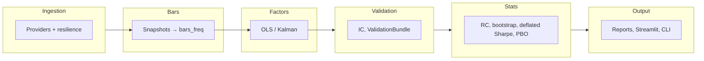

# Crypto-Analyzer  
## Deterministic Crypto Research Platform

[](https://www.python.org/)
[](LICENSE)
[](#development--verification)

A local-first research platform for crypto markets: **ingest** from public CEX/DEX APIs into one SQLite database, **materialize** bars and factors, then **validate** signals and run walk-forward backtests with overfitting controls. No API keys, no trading — analysis and reports only.

**What this is (in four bullets):**

- **Single SQLite source of truth** — All data, bars, factor runs, and (when opted in) regime and promotion state live in one database. No cloud, no vendor lock-in.
- **Versioned migrations** — Core and factor tables via `run_migrations`; Phase 3 (regimes, promotion) via `run_migrations_phase3` only when you enable it. Default behavior is unchanged.
- **Statistical defenses** — Walk-forward splits, block bootstrap, deflated Sharpe, PBO proxy, multiple-testing correction (BH/BY), and optional Reality Check (max-statistic bootstrap). Romano–Wolf is a stub behind a flag.
- **Governance and reproducibility** — Deterministic run IDs (`dataset_id`, `factor_run_id`, `regime_run_id`, `family_id`), artifact hashes, optional promotion workflow (exploratory → candidate → accepted) with audit log.

---

### Reading paths

| If you want to… | Read this |
|-----------------|-----------|
| **Quickstart (5 minutes)** | [Quickstart](#quickstart) → run a few commands and generate a report. |
| **For researchers** | [Why it’s trustworthy](#why-its-trustworthy), [Core workflows](#core-workflows), [Determinism & reproducibility](#determinism--reproducibility). |
| **For engineers** | [Architecture at a glance](#architecture-at-a-glance), [CLI cheatsheet](#cli-cheatsheet), [Development / Verification](#development--verification). |
| **For reviewers** | [Why it’s trustworthy](#why-its-trustworthy), [Statistical defenses](#why-its-trustworthy) and [Determinism](#determinism--reproducibility); then [docs/spec/system_overview.md](docs/spec/system_overview.md). |

---

## Quickstart

Prerequisites: Python 3.10+. No API keys (public endpoints only).

```powershell
git clone https://github.com/AlpharomeroJL/Crypto-Anaylzer.git && cd Crypto-Anaylzer
python -m venv .venv
.venv\Scripts\activate
pip install -r requirements.txt
```

Minimal path to a research report:

```powershell
.\scripts\run.ps1 doctor
.\scripts\run.ps1 universe-poll --universe --universe-chain solana --interval 60
.\scripts\run.ps1 materialize --freq 1h
.\scripts\run.ps1 reportv2 --freq 1h --out-dir reports --hypothesis "baseline momentum"
```

One-command demo (preflight + poll + materialize + report): `.\scripts\run.ps1 demo`

---

## Why it’s trustworthy

- **Leakage controls** — Causal factor residuals (no future data); strict train/test separation in walk-forward; research-only boundary check in CI (no order/submit/broker or API keys in code).
- **Reproducibility** — Stable IDs for dataset, factor run, regime run, and Reality Check family; fixed seeds for bootstrap and Reality Check; optional `CRYPTO_ANALYZER_DETERMINISTIC_TIME` so materialize and reportv2 produce identical outputs on rerun.
- **Statistical defenses** — Walk-forward splits; block bootstrap (seeded, preserves serial correlation); deflated Sharpe; PBO proxy; multiple-testing correction (BH/BY); optional Reality Check (bootstrap-based null for data snooping, keyed by `family_id`). Romano–Wolf is a feature-flagged stub (NotImplementedError).
- **Single source of truth** — One SQLite DB; versioned, idempotent migrations (`run_migrations` for core + v2; `run_migrations_phase3` opt-in only). Ingestion uses the ingest API (writes, migrations, provider chains); dashboard uses read-only `read_api`. No test performs live HTTP; all research tests use mocked HTTP and are deterministic where applicable.

---

### Design rationale

**Why deterministic IDs?** So every run is traceable and repeatable: same inputs and config produce the same `dataset_id`, `factor_run_id`, and artifact hashes. That lets you compare runs, invalidate caches when data changes, and prove reproducibility in audits or reviews. **Why opt-in migrations?** Phase 3 (regimes, promotion, sweep tables) adds schema and behavior that not every user needs. Keeping it opt-in preserves a minimal default: one DB, core + factor tables, no extra complexity until you enable it. **Why governance modeling?** Research that moves toward production needs a path from “exploratory” to “accepted” with clear gates (IC, Reality Check, execution evidence) and an audit log. The promotion workflow and ValidationBundle give you that without forcing it on single-run or ad-hoc use.

---

## Architecture at a glance



- **Stages:** Ingest (provider chains, retry/backoff, circuit breakers, last-known-good cache) → Bars (deterministic OHLCV) → Factors (rolling OLS or optional Kalman; `factor_run_id`) → Signals → Validation (IC, decay, per-signal ValidationBundle) → Statistical corrections → Reporting / UI. Optional: Regime models (opt-in); Reality Check (opt-in); Promotion workflow (opt-in).
- **Ingest vs read_api:** Poll and migrations use `crypto_analyzer.ingest`; dashboard and health use `read_api` only.
- **Phase 3 (opt-in):** Set `CRYPTO_ANALYZER_ENABLE_REGIMES=1` and run `run_migrations_phase3` for regime_runs, regime_states, promotion_candidates, promotion_events, sweep tables. Default `run_migrations()` does not apply Phase 3.

Full pipeline and contracts: [docs/spec/system_overview.md](docs/spec/system_overview.md).

---

## Core workflows

1. **Ingest** — Poll writes to `spot_price_snapshots`, `sol_monitor_snapshots`, `provider_health`, universe tables. `run_migrations` applies core + v2 factor tables when opening the DB.
2. **Bars** — Raw snapshots → deterministic OHLCV bars (5min, 15min, 1h, 1D). Idempotent.
3. **Factors** — Rolling OLS (or optional Kalman) vs BTC/ETH → residual returns. Materialized to `factor_model_runs`, `factor_betas`, `residual_returns`; identified by `dataset_id` and `factor_run_id`.
4. **Signals** — Cross-sectional factors (size, volume, momentum); winsorized z-scores; signal panels.
5. **Validation** — IC, IC decay, orthogonalization; per-signal ValidationBundle (paths, metrics).
6. **Corrections** — Deflated Sharpe, PBO proxy, block bootstrap, BH/BY; optional Reality Check (reportv2 `--reality-check`, `family_id`).
7. **Reporting** — reportv2 (and optional regime-conditioned IC with `--regimes REGIME_RUN_ID` when regimes enabled); Streamlit dashboard; experiment registry; manifests.

**Opt-in:**

- **Regimes** — `CRYPTO_ANALYZER_ENABLE_REGIMES=1`, then `run_migrations_phase3` and regime materialize. reportv2 `--regimes REGIME_RUN_ID` for regime-conditioned summaries. Regime logic lives in `crypto_analyzer/regimes/` (e.g. RegimeDetector, legacy classify).
- **Reality Check** — reportv2 `--reality-check`; RC null cache keyed by `family_id` + config + dataset + git.
- **Promotion workflow** — Create candidate (CLI `promotion create` or Streamlit); evaluate (IC, t-stat, BH-adjusted p-value, optional regime robustness, RC, execution evidence); append-only audit in `promotion_events`. See [docs/spec/system_overview.md](docs/spec/system_overview.md).

---

## CLI cheatsheet

All commands: `.\scripts\run.ps1 <command> [args...]`

| Command | Description |
|---------|-------------|
| `doctor` | Preflight: environment, DB schema, pipeline smoke test |
| `poll` | Single-pair data poll (provider fallback) |
| `universe-poll --universe ...` | Multi-asset universe discovery (e.g. `--universe-chain solana`) |
| `materialize` | Build OHLCV bars (e.g. `--freq 1h`) |
| `reportv2` | Research report: IC, orthogonalization, PBO, QP; optional `--regimes`, `--reality-check`, `--execution-evidence` when Phase 3 enabled |
| `walkforward` | Walk-forward backtest, out-of-sample fold stitching |
| `null_suite` | Null/placebo runner (random ranks, permuted signal, block shuffle) |
| `promotion` | Promotion subcommands: list, create, evaluate (opt-in) |
| `verify` | Full gate: doctor → pytest → ruff → research-only boundary → diagram export |
| `test` | Run pytest |
| `streamlit` | Interactive dashboard (12 pages) |
| `demo` | One-command demo: doctor → poll → materialize → report |
| `check-dataset` | Inspect dataset fingerprints and row counts |

---

## Determinism & reproducibility

| ID or mechanism | What it keys |
|-----------------|--------------|
| **dataset_id** | Stable hash from table summaries (row counts, min/max ts). Dataset change invalidates derived caches. |
| **factor_run_id** | Hash of dataset_id + factor config (freq, window, estimator). One factor materialization run. |
| **regime_run_id** | One regime materialization run (when regimes enabled). |
| **run_id** | Stable hash of payload (e.g. manifest); used in manifests and artifact paths. |
| **family_id** | Reality Check family (signal×horizon); used in RC cache and promotion gating. |
| **Artifact SHA256** | File hashes for validation bundles and outputs; deterministic rerun test compares bundle and manifest bytes. |
| **CRYPTO_ANALYZER_DETERMINISTIC_TIME** | Fixes timestamps so materialize and reportv2 produce identical outputs on rerun. |
| **Bootstrap / RC seed** | Fixed seed → reproducible null distributions and CIs; seed stored in artifacts. |

---

## Development / Verification

- **Full verification:** `.\scripts\run.ps1 verify` runs doctor → pytest → ruff → research-only boundary check → diagram export. No test performs live HTTP.
- **Faster tests:** `python -m pytest -q -m "not slow"` (skips full report-pipeline tests). See `pyproject.toml` for the `slow` marker.
- **Lint:** `ruff check .` and `ruff format .`. Diagram export: `.\scripts\export_diagrams.ps1` (PlantUML in [docs/diagrams/README.md](docs/diagrams/README.md)).

---

## Documentation index

| Document | Contents |
|----------|----------|
| [Spec index (canonical)](docs/spec/README.md) | Master spec, system overview, implementation ledger, component specs |
| [System overview](docs/spec/system_overview.md) | Pipeline lifecycle, determinism, statistical stack, feature flags, promotion |
| [Implementation ledger](docs/spec/implementation_ledger.md) | Requirement → status, PRs, evidence |
| [Design](docs/design.md) | Data flow, provider contracts, failure modes |
| [Architecture](docs/architecture.md) | Module responsibility matrix |
| [Contributing](CONTRIBUTING.md) | Dev setup, testing, style, adding providers, verify |
| [Diagrams](docs/diagrams/README.md) | PlantUML index and export |
| [Audit notes](docs/audit/README.md) | Architecture audits and alignment reports (optional) |

---

## Troubleshooting

| Problem | Solution |
|---------|----------|
| No data in dashboard | Run `poll` (or universe-poll) then `materialize` |
| Bars table not found | Run `.\scripts\run.ps1 materialize --freq 1h` |
| Provider DOWN | Circuit breaker; auto-recovers after cooldown |
| reportv2 --regimes fails | Set `CRYPTO_ANALYZER_ENABLE_REGIMES=1`, run Phase 3 migrations, then regime materialize |
| Verify fails | Run `doctor`; ensure venv active; fix ruff/pytest as indicated |

---

## Limitations / future work

- **Data scope:** Ingestion is public CEX/DEX only; no authenticated feeds or private data. Universe discovery is config- and provider-dependent (e.g. Solana DEX). No real-time execution or order routing.
- **Statistical:** Romano–Wolf is a stub (feature-flagged); deflated Sharpe and PBO rely on simplifying assumptions. Reality Check and block bootstrap are implemented and used; full multiple-comparison and regime-robust inference remain areas for extension.
- **Scale:** SQLite is the single store; suitable for research and moderate history. Large-scale or multi-process write workloads would need a documented migration path (e.g. Postgres for experiment registry already optional).
- **Governance:** Promotion workflow and sweep registry are opt-in and evolving; thresholds and gating policy may be refined with use. Execution-evidence and capacity gates are in place; further realism checks are possible.

---

## License and disclaimer

MIT License. See [LICENSE](LICENSE).

**Research-only.** This tool analyzes data and produces reports. It does not execute trades, hold API keys, or connect to any broker. Opt-in features (regimes, Phase 3 migrations, Reality Check, promotion) do not change default behavior.
