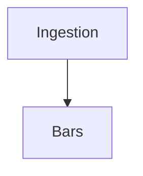

# Doc quality plan

Plan to normalize and improve documentation consistency across `docs/spec` and related audit docs. **DOC-ONLY: no code edits.** Inputs: `architecture_integrity_audit.md`, `drift_register.md`, `docs/spec/master_architecture_spec.md`, `docs/spec/components/*`.
This plan also standardizes **GitHub rendering** (Mermaid fences + math delimiters).

---

## What is inconsistent today (style / format / links)

### Style and format

- **Heading levels:** Master spec uses `##`, `###`, `####` (e.g. `#### *Ingestion*`); components use `##`, `###` with stage names as `### *Ingestion*`. Inconsistent use of italics for stage names (`*Ingestion*` vs `Ingestion`).
- **Bold vs plain:** Some docs use **Bold** for term definitions (e.g. **Required invariants**); others use **Bold** only for headings. Contract sections (Inputs, Outputs, Required invariants, Where errors…) are bold in pipeline_contracts but not always in master (which uses bold for inline terms).
- **Lists:** Mix of `-` and `\-` (escaped hyphen in master); components use `-`. Master has `\-` in many list items; components use plain `-`.
- **Line breaks:** Master uses two spaces at end of line in some places; components use consistent single newline. Blank lines between sections vary (e.g. `---` vs double newline).
- **Code/contract blocks:** interfaces.md uses fenced ``` blocks for pseudocode; pipeline_contracts has no fenced blocks. Master has inline code in narrative (e.g. `ts_utc`, `load_snapshots()`).
- **Tables:** implementation_ledger uses markdown tables; master has large tables with `$$...$$` link refs. Some tables use `| :---- |` alignment; others don’t.

### Links and references

- **Canonical spec link:** Components consistently say “Canonical spec: [../master_architecture_spec.md](../master_architecture_spec.md)” or “(master_architecture_spec.md)”. implementation_ledger uses `[master_architecture_spec.md](master_architecture_spec.md)` and `[components/...](components/...)` (relative from spec/). Inconsistent: some use `../`, some use same-dir.
- **Cross-references:** Master uses `[\[1\]](url)` style (numbered refs to GitHub URLs). Components rarely link to code; they reference “design.md”, “migrations.py” in prose. No single convention for “see also” (e.g. pipeline_contracts ↔ interfaces).
- **Broken or repo-specific URLs:** Master links to `https://github.com/AlpharomeroJL/Crypto-Anaylzer/blob/main/...`; these are repo-specific and may break on fork/rename. implementation_ledger uses relative links; audit docs use file paths only.
- **Drift/audit references:** drift_register uses IDs (D1, I1, S1); architecture_integrity_audit and simplification_plan refer to “drift”, “audit” without always citing drift ID. No standard “see drift_register §D2.”

### Content gaps

- **Failure modes:** Master (Report A/B) has explicit “Failure modes” sections; pipeline_contracts has “Where errors are handled vs surfaced” but no “Failure modes” subsection per stage. risk_audit has “What NOT to implement” but not “Failure modes” as a heading.
- **Invariants:** pipeline_contracts has “Required invariants” per stage; interfaces.md has “Leakage hardening requirement” and “Determinism guarantees” but not a single “Required invariants” block per component.
- **Examples:** implementation_ledger has “Evidence/hashes” and “Example row” in schema_plan (in master); interfaces and testing_acceptance have no “Example” subsections. dependency_graph has no example pipeline run.
- **Contract blocks:** pipeline_contracts uses **Inputs**, **Outputs**, **Required invariants**, **Where errors…**; interfaces uses **Inputs**, **Outputs**, **Function signatures**, **Error handling**, **Determinism guarantees**. No single template for “stage contract” vs “interface contract.”

---

## Normalization spec

Apply the following rules when editing docs (not to code).

### Headings

- **Level 1 (`#`):** Document title only (one per file).
- **Level 2 (`##`):** Major sections (e.g. “Pipeline contract”, “Risk audit”, “Proposed refactor slices”).
- **Level 3 (`###`):** Subsections (e.g. stage name “Ingestion”, “Bar materialization”, or “Slice 1”).
- **Level 4 (`####`):** Only when necessary for sub-stages or sub-items; avoid deep nesting.
- **Stage names:** Use plain text (e.g. `### Ingestion`) or bold (e.g. `### **Ingestion**`); do not use italics for stage names in new or refactored content. Existing `*Ingestion*` can remain until a pass that normalizes all.
- **Consistency:** All component docs under `docs/spec/components/` use the same heading style; master may keep its current style but should align “Repo system decomposition” with components where they duplicate.

### Contract blocks (pipeline stages)

For each pipeline stage (Ingestion, Bar materialization, …, Reporting), use this order and labels:

1. **Inputs** — Bullet list of inputs (data, tables, parameters).
2. **Outputs** — Bullet list of outputs (tables, in-memory structures, files).
3. **Required invariants** — Bullet list of invariants that must hold (determinism, keys, no nulls, etc.).
4. **Where errors are handled vs surfaced** — Bullet list: what is handled internally vs what causes exit/warn.
5. **Failure modes** *(optional but recommended)* — When this stage “breaks” or produces wrong results; how to detect (e.g. “Missing bars_1h when building bars_1D → explicit message”; “Misaligned indices → NaN IC”).

Use bold for these block titles. Use `-` for list items (no escaped hyphen).

### Contract blocks (interfaces)

For each component (Residualizer, RegimeDetector, ExecutionCostModel, etc.):

1. **Inputs** — Bullet list.
2. **Outputs** — Bullet list or type.
3. **Function signatures** — Fenced code block (pseudocode or Python).
4. **Error handling** — Bullet list (raise vs return empty vs log).
5. **Determinism guarantees** — Bullet list (ordering, RNG, seed).
6. **Required invariants** or **Leakage hardening requirement** *(if applicable)* — Bullet list.

Use bold for block titles. Use fenced ``` for signatures.

### Invariants section

- Every pipeline stage must have a **Required invariants** subsection.
- Every interface that has state or ordering guarantees must have **Determinism guarantees** and, if relevant, **Leakage hardening requirement** or **Required invariants**.
- Wording: “Must …”, “Must not …”, “Always …” for hard requirements; “Should …” only for recommendations (and label as “(recommended)”).

### Math + diagrams (GitHub-safe rendering)

**Goal:** ensure Markdown renders correctly in GitHub *without* relying on nonstandard LaTeX escapes.

**Rules**

1) **Mermaid diagrams must be fenced**:

````

````

2) **Do not escape normal punctuation** in prose:
   - Use `+`, `=`, `-` as-is (avoid `+`, `=`, `\-` in normal text).
   - Keep escapes only where they are required inside a link label like `[\[1\]](...)`.

3) **Math delimiters (if you include equations)**:
   - Inline: use `$...$` (not backslash-paren LaTeX style).
   - Display: use `$$...$$` (not backslash-bracket LaTeX style).
   - If you need aligned multi-line, wrap with:
     `$$\begin{aligned} ... \end{aligned}$$`

4) **Avoid raw backslash-bracket in tables and prose** unless you truly mean a literal backslash.

5) **Display math on one line:** Put the whole formula on the same line as the closing `$$` (e.g. `$$c_m = \sum_{j=1}^{m} \frac{1}{j}$$`). Do not put a newline between `$$` and the formula, or GitHub may render each token on a separate line.

### Failure modes

- Where useful, add a **Failure modes** subsection: “When it breaks” and “How to detect.”
- Pipeline stages: at least Ingestion, Bar materialization, Factor model, Signal validation, Reporting (the ones that can “fail” in a user-visible way).
- risk_audit: keep “Leakage vectors” and “What NOT to implement”; add “Failure modes” only if it adds clarity (e.g. “When leakage is present: detect via sentinel test”).

### Examples

- **Pipeline:** One “Example (minimal)” per stage is optional; if present, one line (e.g. “Example: load_snapshots() → bars_1h with 3 pairs, 1000 rows.”).
- **Interfaces:** One “Example” per component optional (e.g. “Example: adjust([0.01, 0.04, 0.03], method='bh', q=0.05) → adjusted p-values.”).
- **implementation_ledger:** Keep “Evidence/hashes” and “Example row” where already present; add “Example” only for new rows if it helps.

### Links

- **Within repo:** Use relative links. From `docs/spec/components/X.md` to master: `[../master_architecture_spec.md](../master_architecture_spec.md)`. From `docs/spec/implementation_ledger.md`: `[master_architecture_spec.md](master_architecture_spec.md)` and `[components/foo.md](components/foo.md)`.
- **Canonical spec:** Every component must have at the top: “**Canonical spec:** [../master_architecture_spec.md](../master_architecture_spec.md)” (or equivalent from its path).
- **Drift/audit:** When referring to drift register, use “(drift_register.md §D2)” or “see drift_register.md, D2.” When referring to audit, use “(architecture_integrity_audit.md §8)” or “see architecture_integrity_audit.md, Recommended changes.”
- **Code references:** Prefer “`crypto_analyzer/data.py`” or “data.py” in prose; avoid long GitHub URLs in new content. Existing master spec links can remain until a dedicated link pass.

---

## List of doc edits (per file)

### docs/spec/master_architecture_spec.md

- Normalize list markers: replace `\-` with `-` where it is plain list content (not inside a table).
- Add **Failure modes** under “Pipeline contract” for at least: Ingestion, Bar materialization, Factor model, Signal validation, Reporting (one bullet each: when it breaks, how to detect).
- Ensure each pipeline stage has **Required invariants** and **Where errors are handled vs surfaced** (already largely present; align labels with pipeline_contracts).
- Add one sentence under “Factor model” that reportv2 currently builds factors in-memory and does not use materialized factor_run_id by default (align with drift D2).
- Add one sentence under “Backtest and walk-forward” or “Factor model” that walk-forward in reportv2 does not re-fit factors per fold (align with drift D6).
- Optionally: add “Promotion (candidate → accepted)” under Reporting and reference dependency_graph / phased_execution.

### docs/spec/components/pipeline_contracts.md

- Add **Failure modes** (one bullet per stage) after “Where errors are handled vs surfaced” for: Ingestion, Bar materialization, Factor model, Signal validation, Reporting.
- Add under Signal validation **Outputs**: “ValidationBundle per signal (IC series, decay, turnover, artifact paths); see validation_bundle.py and reportv2.” (align with drift I1.)
- Add under a new “Execution realism” subsection or under Portfolio/Reporting: “ExecutionCostModel (execution_cost.py): fee, slippage, optional spread_vol_scale and participation impact; all cost application paths delegate here.” (align with drift I2.)
- Normalize stage headings: use `### Ingestion` (no italics) for consistency with normalization spec, or keep `### *Ingestion*` and document that italics = stage name.
- Add “Provider chain pattern implemented via registry + resilience; poll orchestrates fetches and writes.” under Ingestion (align with drift D1).

### docs/spec/components/interfaces.md

- Add **Required invariants** (or keep **Leakage hardening requirement** where it exists) for Residualizer, RegimeDetector, ExecutionCostModel; ensure Bootstrapper has **Determinism guarantees** (seed).
- Add one line under MultipleTestingAdjuster: “Romano–Wolf: implemented, opt-in via CRYPTO_ANALYZER_ENABLE_ROMANOWOLF=1; outputs rw_adjusted_p_values when enabled (historical: this plan predates RW implementation; see methods_and_limits.md §9).” (align with drift I7.)
- Add optional **Example** one-liner per component (pseudocode or call example).

### docs/spec/components/testing_acceptance.md

- Add under Integration tests: “Null suite: `crypto_analyzer/null_suite.py`, CLI `scripts/run.ps1 null_suite`; artifacts null_ic_dist.csv, null_sharpe_dist.csv, null_pvalues.json.” (align with drift I6.)
- Add under Integration tests: “Deterministic rerun: test_reportv2_deterministic_rerun with CRYPTO_ANALYZER_DETERMINISTIC_TIME; byte-identical bundle and manifest.” (align with drift S15.)
- Add “(recommended)” or “(mandatory gate)” next to “Null model baseline” and “Deterministic re-run test” for clarity.

### docs/spec/components/risk_audit.md

- Add under “Leakage vectors”: “Current status: signal_residual_momentum_24h default is allow_lookahead=False; research_report.py does not pass explicit flag (default remains causal).” (align with drift D5.)
- Add one sentence: “scan.py _add_capacity_slippage_tradable is research-only proxy; do not use for promotion/execution evidence without explicit disclaimer.” (align with audit recommendation #8.)
- Optionally add **Failure modes** subsection: when leakage is present (detect via sentinel test); when regime smoothing is used in test (detect via raise).

### docs/spec/components/performance_scale.md

- Add **Concrete cache modules**: “factor_cache (stats/factor_cache.py), regime_cache (stats/regime_cache.py), rc_cache (stats/rc_cache.py); keys include dataset_id, config_hash, family_id; --no-cache and CRYPTO_ANALYZER_NO_CACHE disable.” (align with drift I4, S14.)
- Add “Determinism: CRYPTO_ANALYZER_DETERMINISTIC_TIME for reproducible materialize and reportv2 rerun.” (align with drift I8.)

### docs/spec/components/versioning_release.md

- Add “Reproducibility: CRYPTO_ANALYZER_DETERMINISTIC_TIME (timeutils) for deterministic timestamps in materialize and reportv2; document in README or run.ps1 help.” (align with drift I8.)
- Keep “Add: engine_version, config_version” as-is (implementation in simplification_plan Slice 4).

### docs/spec/components/dependency_graph.md

- Add one line under “Refined graph”: “Promotion (candidate → accepted) and Experiment Registry & Manifests are part of Reporting.” (align with drift I5.)
- No structural change to Mermaid blocks.

### docs/spec/components/phased_execution.md

- No content change required; already has checkboxes and slice notes. Optionally add at top: “Canonical status: implementation_ledger and drift_register (S1–S15) record completed items.”

### docs/spec/components/schema_plan.md

- If present: add “Phase 3 tables (regime_runs, regime_states, promotion_*, sweep_*) are created only by run_migrations_phase3; opt-in (e.g. CRYPTO_ANALYZER_ENABLE_REGIMES and explicit phase3 migration call). Core run_migrations does not apply phase3.” (align with drift I3.)

### docs/spec/implementation_ledger.md

- Update “Implementation status” for rows that are Done in code but still “Not started” (e.g. ExecutionCostModel, Bootstrapper, MultipleTestingAdjuster, integration tests, versioning, performance, risk audit) to “Done” with a short note and test reference where applicable (align with drift S1–S15).
- Romano–Wolf is now implemented (opt-in); ledger and interfaces updated. Historical note (drift I7): see methods_and_limits.md §9.
- Ensure “Canonical spec” link is relative: `[master_architecture_spec.md](master_architecture_spec.md)` and component links `[components/foo.md](components/foo.md)`.

### docs/audit/architecture_integrity_audit.md

- Add “See drift_register.md (D1–D6, I1–I8, S1–S15) for spec mismatch and implementation-stronger items.” near the top or in “Recommended changes.”
- No structural change to tables or sections.

### docs/audit/drift_register.md

- No mandatory edits; already has IDs and tables. Optionally add at top: “Cross-reference: architecture_integrity_audit.md §1 (drift table), §8 (recommendations); architecture_simplification_plan.md (slices).”

### docs/audit/architecture_simplification_plan.md

- In “Top 5 flow problems,” add drift/audit ref in parentheses (e.g. “Ref: Drift D2”) where already present; no change if already there.
- No structural change.

---

## What NOT to change (canonical spec rules)

- **Do not remove or reword** the “Assumptions (explicit)” and “When I say leakage” paragraph at the top of master_architecture_spec.md; they define scope.
- **Do not remove** Report A and Report B mechanism specs (Goal, Inputs, Core transformations, Outputs, Assumptions, Validation method, Operational constraints, Failure modes, Hidden statistical assumptions). They are canonical research intent.
- **Do not delete** any pipeline stage from the contract (Ingestion through Reporting). Only add subsections (e.g. Failure modes) or clarify wording.
- **Do not change** the semantics of “Required invariants” or “Where errors are handled vs surfaced” when editing—only add bullets or normalize formatting. Do not remove an invariant that the code still guarantees.
- **Do not rename** component files in docs/spec/components/ (pipeline_contracts.md, interfaces.md, etc.); links and “Canonical spec” references depend on current names.
- **Do not merge** master_architecture_spec.md and pipeline_contracts.md into one file; master is the umbrella, components are the detailed contract. Cross-references only.
- **Do not remove** implementation_ledger requirement rows; only update status, PR link, files changed, tests, evidence. Add new rows for new requirements.
- **Do not change** phased_execution checkboxes from [x] to [ ] for items that are already implemented and verified; only add new checkboxes for future work.
- **Do not introduce** new canonical sources (e.g. a “single contract.md”) without updating this plan and the “Canonical spec” pointers in every component.

---

**Files changed (this plan):**  
- Added: `docs/audit/doc_quality_plan.md`

**Commands to run:**  
- None (doc-only).

**What to look for:**  
- When applying edits: follow “List of doc edits” per file; use “Normalization spec” for any new or heavily edited section; respect “What NOT to change.”
