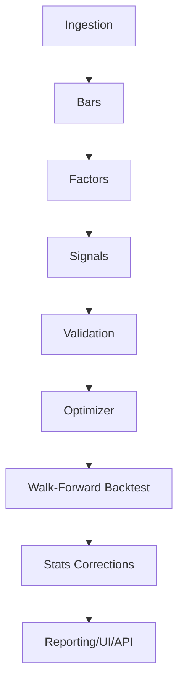
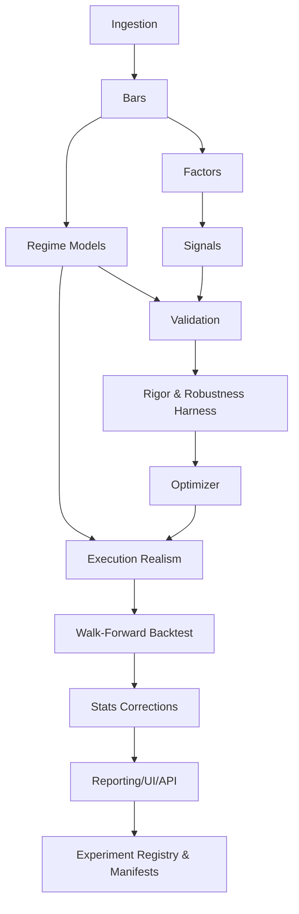

# Dependency graph

**Purpose:** Baseline and refined pipeline dependency graphs (Mermaid) showing stage order and where new research components plug in.  
**Canonical spec:** [../master_architecture_spec.md](../master_architecture_spec.md)

---

## Baseline dependency graph

---

## Refined graph with new research components

Refined graph with **new research components inserted where they belong** (and without breaking existing stage boundaries):

