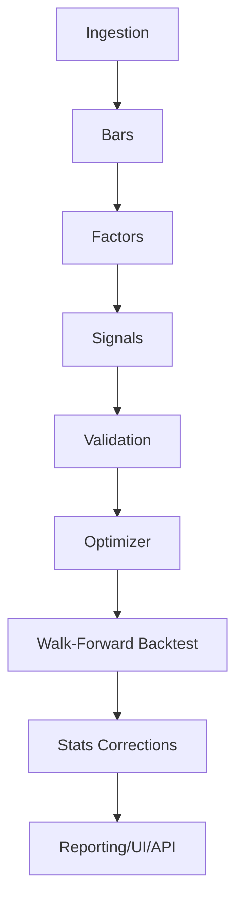
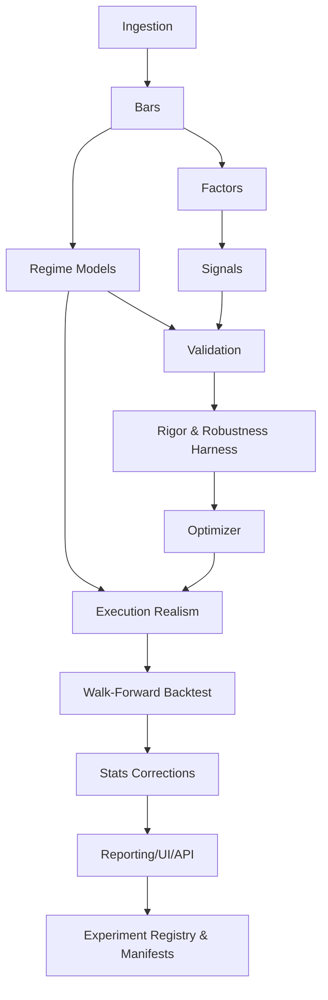

# Architecture Review and Integration Plan for Crypto‑Anaylzer Research Upgrades

**Assumptions (explicit)**  
Report A = *“Upgrading Crypto‑Anaylzer into a 10/10 Quant Research Repository”* (uploaded PDF).   
Report B = *“Deep Research: Upgrading Crypto‑Analyzer with Statistical Rigor, Execution Realism, Regime Detection, and Robustness Defenses”* (uploaded PDF).

Repo baseline = AlpharomeroJL/Crypto-Anaylzer on main, with SQLite as the core store, deterministic bar materialization, rolling OLS factor decomposition, IC + IC decay + orthogonalization, portfolio construction, walk-forward, and overfitting controls as described in the README and design docs. [\[1\]](https://github.com/AlpharomeroJL/Crypto-Anaylzer/blob/main/README.md) [\[2\]](https://github.com/AlpharomeroJL/Crypto-Anaylzer/blob/main/docs/design.md)  
When I say “leakage,” I mean **any** use of information not available at decision time (lookahead), or any evaluation procedure that reuses test data in model/feature selection (data snooping), even if unintentional.

## Research mechanism extraction

### Report A mechanism spec

**Goal (1–2 sentences)**  
Upgrade the existing research stack from “institutional hygiene + solid architecture” into “institutional inference + execution realism + model originality,” while keeping outputs reproducible and defensible under many-trials research workflows. 

**Inputs (data fields, frequency, universe constraints)**  
SQLite-stored OHLCV bars (multiple frequencies) plus upstream snapshot provenance and reference factors (BTC/ETH), with a cross-sectional universe subject to liquidity/quality constraints and “run manifests / dataset fingerprinting” for lineage. 

**Core transformations (math/logic steps)**  
Rolling multi-factor beta decomposition (baseline) → expand with:  
- Formal **multiple-testing control** and “data snooping” defenses (FDR variants; Reality Check / stepwise procedures) instead of warnings.  
- Replace rolling-window beta (hard cutoff) with **state-space / Kalman dynamic beta** plus uncertainty bands.  
- Add “trading physics”: spread + participation/impact cost curves + scheduling (TWAP/VWAP) + latency/staleness modeling; report capacity-vs-performance degradation.  
- Optional “math depth” extensions: Bayesian regression / posterior uncertainty propagation into portfolio weights.  
- Optional “alpha originality” extensions: latent factors (autoencoder/IPCA), topology/network regimes, DEX microstructure-derived features. 

**Outputs (signals, forecasts, weights, risk estimates)**  
A standardized “validation bundle” per signal variant: IC series, t-stats, bootstrap CIs, multiple-testing-adjusted p-values, sensitivity summaries, null/permutation diagnostics, plus portfolio weights and regime/cost-conditioned performance artifacts. 

**Assumptions (stationarity, liquidity, independence, etc.)**  
Hidden assumptions that must be made explicit to avoid false certainty:  
- Multiple-testing control: BH-style procedures assume independence or a defined dependence structure; dependency-robust variants are more conservative but still require careful interpretation.  
- Reality Check / strategy comparisons implicitly assume the resampling scheme preserves dependence structure sufficiently for the null distribution to be meaningful.  
- Execution/capacity models assume a stable mapping from liquidity/volume proxies to spread/impact and that backtest trade sizes are “small enough” to be approximated at bar granularity.  
- State-space beta assumes a (usually Gaussian, linear) latent evolution model; mis-specification risk is high in regime shifts. 

**Validation method (exact metrics + splits + anti-leakage)**  
- Walk-forward (train/test separation), block/bootstrap uncertainty, deflated Sharpe / PBO-style controls, plus formal multiple-testing controls for “many signals/horizons/variants.” 

**Operational constraints (latency, capacity, costs, slippage model)**  
- Costs must be state-dependent and size-dependent (spread + impact), with explicit participation constraints and sensitivity curves vs AUM/notional size. 

**Failure modes (when it breaks, how to detect)**  
- “Passing by search”: a single great backtest emerging from many trials; detect via corrected inference and reporting “survivors.”  
- “Tradability cliff”: signal disappears under spread/impact/latency; detect via capacity-vs-Sharpe curves and latency sweeps.  
- “Regime overfit”: performance concentrated in one micro-regime; detect via regime-conditioned IC/PnL and stability artifacts. 

**Hidden statistical assumptions & leakage risks (Report A emphasis)**  
- **Leakage risk: “research upgrades” that require fitting** (Kalman beta, Bayesian regression, latent factors) can easily become full-sample fits unless the pipeline enforces *per-fold* estimation and strictly causal filtering (no smoothing using future data).  
- **Leakage risk: parameter sweeps** turn the research process into an implicit optimizer over the same dataset; without corrected inference, you will select noise.  
- **Assumption risk: bootstrap choice**—naïve shuffles destroy serial dependence and can understate uncertainty; time-series bootstraps must preserve dependence. 

### Report B mechanism spec

**Goal (1–2 sentences)**  
Build a coherent “Evidence layer” that standardizes signal evaluation, adds execution realism, introduces regime conditioning, and installs robustness defenses that prevent promoting noise to “production-grade research conclusions.” 

**Inputs (data fields, frequency, universe constraints)**  
- Bars and returns (multi-frequency), research universe filtered by liquidity/volume, factor returns (BTC/ETH), plus provenance/quality gates and experiment registry/manifest lineage. 

**Core transformations (math/logic steps)**  
- Statistical rigor layer: automatic IC tracking (incl. t-stat), rolling stability, sensitivity sweeps, bootstrap CIs, structured tear-sheet-like artifacts. fileciteturn0file1  
- Execution realism layer: explicit spread model + participation-based slippage/impact + position caps (liquidity/ADV), and consistent enforcement through optimizer & simulator.

- Regime module: move from purely heuristic labels to statistically anchored volatility/regime models (ARCH/GARCH; Markov switching) and use regime probabilities when possible.  
- Robustness defense: permutation/shuffle nulls (properly dependence-aware), and explicit data-snooping controls (Reality Check / stepwise multiple testing). 

**Outputs (signals, forecasts, weights, risk estimates)**  
- Standard artifacts: IC distributions, stability series, regime-conditioned performance, cost/capacity-aware PnL, plus “promotion criteria” outputs that tell you what is credible vs exploratory. 

**Assumptions (stationarity, liquidity, independence, etc.)**  
- Treating volatility clustering models or regime switching as stable enough for out-of-sample usefulness; assumes underlying process can be approximated by those families.  
- Spread/impact models constructed from proxies assume those proxies are reasonably monotone with true microstructure costs in the venues you study. 

**Validation method (exact metrics + splits + anti-leakage)**  
- Walk-forward evaluation as the primary split; bootstrap and robustness tests layered on top; Reality Check / stepwise procedures for “many variants tried.” 

**Operational constraints (latency, capacity, costs, slippage model)**  
- Costs must be enforced consistently (screening → optimizer → simulator); regime and cost interaction is first-class (risk-off widens spreads/impact). 

**Failure modes (when it breaks, how to detect)**  
- Regime model overfit / “decorative regimes” that don’t change decisions; detect when regime-conditioned IC/PnL does not materially differ or does not persist out-of-sample.  
- False inference from dependent data using naïve tests; detect via dependence-aware bootstrap/permutation and corrected p-values. 

**Hidden statistical assumptions & leakage risks (Report B emphasis)**  
- **Leakage risk: regime inference**—Markov switching / volatility models can leak if you compute full-sample states and then evaluate “as if known.” You must use train-only estimation and *filtering* (online state) in test.  
- **Leakage risk: cost proxies like ADV**—if “ADV” or liquidity thresholds are computed using future volume/liquidity, costs and capacity constraints become lookahead-biased.  
- **Assumption risk: null tests**—randomly shuffling timestamps breaks autocorrelation; if you use it to claim significance, you will materially mis-estimate the null. 

**Single recommended direction when the reports diverge**  
Both reports propose ambitious optional upgrades (Bayesian + representation learning + network topology). The recommended direction is to **implement “inference discipline + causal regime modeling + execution realism” first** and postpone representation learning until the platform proves it can reject false discoveries at scale. This is aligned with the reports’ shared emphasis that the credibility jump comes from defensible inference and trading physics, not feature proliferation. fileciteturn0file0 

## Repo system decomposition

### Pipeline contract

Below is a **contract-first** decomposition of your current stack based on repo docs and code.

#### *Ingestion*

**Inputs**  
Provider-chain responses (SpotPriceChain, DexSnapshotChain) with resilience wrappers (retry/backoff, circuit breaker, last-known-good cache) and quality gates. [\[5\]](https://github.com/AlpharomeroJL/Crypto-Anaylzer/blob/main/docs/design.md)

**Outputs (SQLite tables)**  
- spot\_price\_snapshots (spot price snapshots + provenance fields). [\[6\]](https://github.com/AlpharomeroJL/Crypto-Anaylzer/blob/main/crypto_analyzer/db/migrations.py)  
- sol\_monitor\_snapshots (DEX pair snapshots + provenance fields). [\[7\]](https://github.com/AlpharomeroJL/Crypto-Anaylzer/blob/main/crypto_analyzer/db/migrations.py) [\[8\]](https://github.com/AlpharomeroJL/Crypto-Anaylzer/blob/main/crypto_analyzer/db/migrations.py)  
- provider\_health (provider status, fail count, disabled\_until, etc.). [\[9\]](https://github.com/AlpharomeroJL/Crypto-Anaylzer/blob/main/crypto_analyzer/db/migrations.py) [\[10\]](https://github.com/AlpharomeroJL/Crypto-Anaylzer/blob/main/docs/design.md)  
- Universe tracking tables (universe\_allowlist, universe\_persistence, universe\_churn\_log). [\[11\]](https://github.com/AlpharomeroJL/Crypto-Anaylzer/blob/main/crypto_analyzer/db/migrations.py)

**Required invariants**  
- ts\_utc is UTC, parseable, and monotonic per asset stream (or at minimum strictly orderable). [\[12\]](https://github.com/AlpharomeroJL/Crypto-Anaylzer/blob/main/crypto_analyzer/data.py) [\[13\]](https://github.com/AlpharomeroJL/Crypto-Anaylzer/blob/main/crypto_analyzer/integrity.py)  
- Provenance columns are always present (provider\_name, fetched\_at\_utc, fetch\_status, error\_message). [\[14\]](https://github.com/AlpharomeroJL/Crypto-Anaylzer/blob/main/docs/design.md) [\[15\]](https://github.com/AlpharomeroJL/Crypto-Anaylzer/blob/main/crypto_analyzer/db/migrations.py)  
- Prices are positive; invalid prices are rejected/dropped by quality gates + loaders. [\[16\]](https://github.com/AlpharomeroJL/Crypto-Anaylzer/blob/main/docs/design.md) [\[17\]](https://github.com/AlpharomeroJL/Crypto-Anaylzer/blob/main/crypto_analyzer/data.py)

**Where errors are handled vs surfaced**  
- Handle provider/network failures inside provider chain (fallback, circuit breaker, LKG). [\[18\]](https://github.com/AlpharomeroJL/Crypto-Anaylzer/blob/main/docs/design.md)  
- Surface integrity problems as warnings and/or strict failure in “doctor / reportv2” depending on flags. [\[19\]](https://github.com/AlpharomeroJL/Crypto-Anaylzer/blob/main/cli/research_report_v2.py)

#### *Bar materialization*

**Inputs**  
- sol\_monitor\_snapshots via load\_snapshots() (with filters) to produce resampled OHLCV-style bars. [\[20\]](https://github.com/AlpharomeroJL/Crypto-Anaylzer/blob/main/cli/materialize.py) [\[21\]](https://github.com/AlpharomeroJL/Crypto-Anaylzer/blob/main/crypto_analyzer/data.py)

**Outputs (SQLite tables)**  
- bars\_{freq} with primary key (ts\_utc, chain\_id, pair\_address) and computed features: log\_return, cum\_return, roll\_vol, liquidity\_usd, vol\_h24. [\[22\]](https://github.com/AlpharomeroJL/Crypto-Anaylzer/blob/main/cli/materialize.py)  
- Special case: bars\_1D is materialized from bars\_1h. [\[23\]](https://github.com/AlpharomeroJL/Crypto-Anaylzer/blob/main/cli/materialize.py)

**Required invariants**  
- Deterministic, idempotent UPSERT semantics (re-running yields identical bars for same underlying snapshots). [\[24\]](https://github.com/AlpharomeroJL/Crypto-Anaylzer/blob/main/cli/materialize.py) [\[25\]](https://github.com/AlpharomeroJL/Crypto-Anaylzer/blob/main/README.md)  
- No non-positive OHLC values; close cannot be null. [\[26\]](https://github.com/AlpharomeroJL/Crypto-Anaylzer/blob/main/cli/materialize.py)

**Where errors are handled vs surfaced**  
- “Too few points,” non-positive OHLC, NaNs → skip pair or return 0 rows. [\[27\]](https://github.com/AlpharomeroJL/Crypto-Anaylzer/blob/main/cli/materialize.py)  
- Missing dependency (e.g., bars\_1h absent when building bars\_1D) surfaces as an explicit message. [\[28\]](https://github.com/AlpharomeroJL/Crypto-Anaylzer/blob/main/cli/materialize.py)

#### *Factor model and decomposition*

**Inputs**  
- Returns matrix including BTC/ETH spot return columns + asset return columns (via get\_research\_assets and get\_factor\_returns in report pipeline). [\[29\]](https://github.com/AlpharomeroJL/Crypto-Anaylzer/blob/main/cli/research_report_v2.py)  
- Rolling window parameters (window, min\_obs) for rolling regressions. [\[30\]](https://github.com/AlpharomeroJL/Crypto-Anaylzer/blob/main/crypto_analyzer/factors.py)

**Outputs (current, in-memory)**  
- Rolling betas per factor, rolling R², and residual returns panel. [\[31\]](https://github.com/AlpharomeroJL/Crypto-Anaylzer/blob/main/crypto_analyzer/factors.py) [\[32\]](https://github.com/AlpharomeroJL/Crypto-Anaylzer/blob/main/crypto_analyzer/factors.py)

**Required invariants**  
- Time alignment: factor returns and asset returns must share the same index and be NaN-cleaned consistently. [\[33\]](https://github.com/AlpharomeroJL/Crypto-Anaylzer/blob/main/crypto_analyzer/factors.py)  
- For “no leak” evaluation: factor model fitting must be restricted to available history per fold (not full-sample). This is **not currently enforced as a contract**, even though rolling regression is available. [\[34\]](https://github.com/AlpharomeroJL/Crypto-Anaylzer/blob/main/crypto_analyzer/factors.py)

**Where errors are handled vs surfaced**  
- Linear algebra issues → NaNs / graceful degradation. [\[35\]](https://github.com/AlpharomeroJL/Crypto-Anaylzer/blob/main/crypto_analyzer/factors.py) [\[36\]](https://github.com/AlpharomeroJL/Crypto-Anaylzer/blob/main/crypto_analyzer/factors.py)

#### *Signal generation*

**Inputs**  
- Asset return panels; factor returns; optional liquidity panel for exposures; lookback horizons per freq. [\[37\]](https://github.com/AlpharomeroJL/Crypto-Anaylzer/blob/main/crypto_analyzer/signals_xs.py) [\[38\]](https://github.com/AlpharomeroJL/Crypto-Anaylzer/blob/main/crypto_analyzer/features.py)

**Outputs (current, in-memory)**  
- Signal panels signal\_df (index=ts\_utc, columns=asset\_id) for momentum and composites (“clean\_momentum”, “value\_vs\_beta”). [\[39\]](https://github.com/AlpharomeroJL/Crypto-Anaylzer/blob/main/crypto_analyzer/alpha_research.py) [\[40\]](https://github.com/AlpharomeroJL/Crypto-Anaylzer/blob/main/crypto_analyzer/signals_xs.py)  
- Cross-sectional factor frames (cs\_factors) and combined composite signals (cs\_model). [\[41\]](https://github.com/AlpharomeroJL/Crypto-Anaylzer/blob/main/crypto_analyzer/cs_factors.py) [\[42\]](https://github.com/AlpharomeroJL/Crypto-Anaylzer/blob/main/crypto_analyzer/cs_model.py)

**Required invariants**  
- Signal timestamps must represent information available at that timestamp (or earlier), and the pipeline must define the execution convention (trade at t+1). Your backtest implementations enforce this by using position.shift(1) before applying returns. [\[43\]](https://github.com/AlpharomeroJL/Crypto-Anaylzer/blob/main/cli/backtest.py)

**Where errors are handled vs surfaced**  
- Missing factors → signal builders return None or empty frames (degrade gracefully). [\[44\]](https://github.com/AlpharomeroJL/Crypto-Anaylzer/blob/main/crypto_analyzer/alpha_research.py)

#### *Signal validation*

**Inputs**  
- Signal panel signal\_df and return panel returns\_df; horizon list. [\[45\]](https://github.com/AlpharomeroJL/Crypto-Anaylzer/blob/main/crypto_analyzer/alpha_research.py) [\[46\]](https://github.com/AlpharomeroJL/Crypto-Anaylzer/blob/main/crypto_analyzer/alpha_research.py)

**Outputs**  
- Forward returns matrix per horizon. [\[45\]](https://github.com/AlpharomeroJL/Crypto-Anaylzer/blob/main/crypto_analyzer/alpha_research.py)  
- IC time-series (Spearman rank IC by default) and summary statistics (mean, std, t-stat, hit rate, CI). [\[47\]](https://github.com/AlpharomeroJL/Crypto-Anaylzer/blob/main/crypto_analyzer/alpha_research.py) [\[48\]](https://github.com/AlpharomeroJL/Crypto-Anaylzer/blob/main/crypto_analyzer/alpha_research.py)  
- IC decay table across horizons. [\[49\]](https://github.com/AlpharomeroJL/Crypto-Anaylzer/blob/main/crypto_analyzer/alpha_research.py)  
- Optional orthogonalization and exposure neutralization outputs. [\[50\]](https://github.com/AlpharomeroJL/Crypto-Anaylzer/blob/main/crypto_analyzer/signals_xs.py) [\[51\]](https://github.com/AlpharomeroJL/Crypto-Anaylzer/blob/main/crypto_analyzer/signals_xs.py)

**Required invariants**  
- Forward returns must exclude contemporaneous return overlap (implemented via rolling sum + shift). [\[45\]](https://github.com/AlpharomeroJL/Crypto-Anaylzer/blob/main/crypto_analyzer/alpha_research.py)  
- Must fail fast (or warn loudly) if signals/returns indices are misaligned or non-monotone; integrity helpers exist but do not yet hard-block most alignment failures. [\[52\]](https://github.com/AlpharomeroJL/Crypto-Anaylzer/blob/main/crypto_analyzer/integrity.py)

**Where errors are handled vs surfaced**  
- Insufficient cross-section (fewer than 2 assets at a timestamp) yields NaN IC at that time. [\[53\]](https://github.com/AlpharomeroJL/Crypto-Anaylzer/blob/main/crypto_analyzer/alpha_research.py)

#### *Portfolio optimization*

**Inputs**  
- Expected returns proxy (signal vector) and covariance matrix; leverage/net/max weight constraints. [\[54\]](https://github.com/AlpharomeroJL/Crypto-Anaylzer/blob/main/crypto_analyzer/optimizer.py) [\[55\]](https://github.com/AlpharomeroJL/Crypto-Anaylzer/blob/main/crypto_analyzer/portfolio_advanced.py)

**Outputs**  
- Weight vector per rebalance time (or last time for “advanced” heuristic). [\[56\]](https://github.com/AlpharomeroJL/Crypto-Anaylzer/blob/main/cli/research_report_v2.py)

**Required invariants**  
- Covariance must be PSD (enforced via eigenvalue clipping). [\[57\]](https://github.com/AlpharomeroJL/Crypto-Anaylzer/blob/main/crypto_analyzer/risk_model.py)  
- Optimizer constraints must be satisfied or fallback is used (rank-based L/S). [\[58\]](https://github.com/AlpharomeroJL/Crypto-Anaylzer/blob/main/crypto_analyzer/optimizer.py) [\[59\]](https://github.com/AlpharomeroJL/Crypto-Anaylzer/blob/main/crypto_analyzer/optimizer.py)

**Where errors are handled vs surfaced**  
- Optimization errors → deterministic fallback weights (rank-based). [\[60\]](https://github.com/AlpharomeroJL/Crypto-Anaylzer/blob/main/crypto_analyzer/optimizer.py)

#### *Backtest and walk-forward*

**Inputs**  
- bars\_{freq} and strategy parameters. [\[61\]](https://github.com/AlpharomeroJL/Crypto-Anaylzer/blob/main/cli/backtest.py)  
- Walk-forward split parameters (train\_bars, test\_bars, step\_bars). [\[62\]](https://github.com/AlpharomeroJL/Crypto-Anaylzer/blob/main/crypto_analyzer/walkforward.py)

**Outputs**  
- Strategy equity curve and fold metrics; stitched out-of-sample equity. [\[63\]](https://github.com/AlpharomeroJL/Crypto-Anaylzer/blob/main/crypto_analyzer/walkforward.py) [\[64\]](https://github.com/AlpharomeroJL/Crypto-Anaylzer/blob/main/crypto_analyzer/walkforward.py)

**Required invariants**  
- No overlap between train and test indices. [\[65\]](https://github.com/AlpharomeroJL/Crypto-Anaylzer/blob/main/crypto_analyzer/walkforward.py)  
- Execution convention: trading decisions at t impact returns beginning at t+1 (implemented by using lagged positions). [\[43\]](https://github.com/AlpharomeroJL/Crypto-Anaylzer/blob/main/cli/backtest.py)

**Where errors are handled vs surfaced**  
- If insufficient data for splits: return empty outputs. [\[66\]](https://github.com/AlpharomeroJL/Crypto-Anaylzer/blob/main/crypto_analyzer/walkforward.py) [\[67\]](https://github.com/AlpharomeroJL/Crypto-Anaylzer/blob/main/crypto_analyzer/walkforward.py)

#### *Statistical correction*

**Inputs**  
- PnL series; estimated number of trials; walk-forward results; bootstrap parameters. [\[68\]](https://github.com/AlpharomeroJL/Crypto-Anaylzer/blob/main/crypto_analyzer/multiple_testing.py) [\[69\]](https://github.com/AlpharomeroJL/Crypto-Anaylzer/blob/main/crypto_analyzer/statistics.py)

**Outputs**  
- Deflated Sharpe-style adjustment (with explicit warnings about rough assumptions). [\[70\]](https://github.com/AlpharomeroJL/Crypto-Anaylzer/blob/main/crypto_analyzer/multiple_testing.py)  
- PBO proxy based on walk-forward results schema. [\[71\]](https://github.com/AlpharomeroJL/Crypto-Anaylzer/blob/main/crypto_analyzer/multiple_testing.py)  
- Block bootstrap distributions and Sharpe CI. [\[72\]](https://github.com/AlpharomeroJL/Crypto-Anaylzer/blob/main/crypto_analyzer/statistics.py) [\[73\]](https://github.com/AlpharomeroJL/Crypto-Anaylzer/blob/main/crypto_analyzer/statistics.py)

**Required invariants**  
- The block bootstrap must not pretend i.i.d. when serial dependence exists; current implementation is a fixed-length block resampler (not stationary bootstrap). [\[74\]](https://github.com/AlpharomeroJL/Crypto-Anaylzer/blob/main/crypto_analyzer/statistics.py)

**Where errors are handled vs surfaced**  
- Small-sample conditions → NaNs + informative messages. [\[75\]](https://github.com/AlpharomeroJL/Crypto-Anaylzer/blob/main/crypto_analyzer/multiple_testing.py) [\[76\]](https://github.com/AlpharomeroJL/Crypto-Anaylzer/blob/main/crypto_analyzer/statistics.py)

#### *Reporting*

**Inputs**  
- Tables in SQLite + derived in-memory analytics; CLI arguments. [\[77\]](https://github.com/AlpharomeroJL/Crypto-Anaylzer/blob/main/cli/research_report_v2.py)

**Outputs**  
- Report markdown + charts + JSON manifests + experiment registry rows (SQLite). [\[78\]](https://github.com/AlpharomeroJL/Crypto-Anaylzer/blob/main/cli/research_report_v2.py) [\[79\]](https://github.com/AlpharomeroJL/Crypto-Anaylzer/blob/main/crypto_analyzer/experiments.py) [\[80\]](https://github.com/AlpharomeroJL/Crypto-Anaylzer/blob/main/crypto_analyzer/governance.py)

**Required invariants**  
- Every run must be traceable to git\_commit, environment fingerprint, dataset fingerprint/id, and output hashes. [\[81\]](https://github.com/AlpharomeroJL/Crypto-Anaylzer/blob/main/crypto_analyzer/governance.py) [\[82\]](https://github.com/AlpharomeroJL/Crypto-Anaylzer/blob/main/crypto_analyzer/dataset.py) [\[83\]](https://github.com/AlpharomeroJL/Crypto-Anaylzer/blob/main/crypto_analyzer/experiments.py)

### Dependency graph

Refined graph with **new research components inserted where they belong** (and without breaking existing stage boundaries):

## Research ↔ repo mapping and schema evolution

### Research ↔ repo mapping table

| Research Mechanism | Pipeline Stage(s) | Status (present/partial/missing/incompatible) | Required Changes | New Interfaces | Tests | Acceptance Criteria |
| :---- | :---- | :---- | :---- | :---- | :---- | :---- |
| Formal “validation bundle” artifact contract (IC series, decay, stability, CIs, etc.) | Validation → Reporting | **Partial** (IC/decay exist; reporting exists, but bundles aren’t fully standardized across all signals) [\[49\]](https://github.com/AlpharomeroJL/Crypto-Anaylzer/blob/main/crypto_analyzer/alpha_research.py) [\[84\]](https://github.com/AlpharomeroJL/Crypto-Anaylzer/blob/main/cli/research_report_v2.py) | Refactor: create ValidationBundle dataclass + one writer; ensure every signal path produces same artifact schema | SignalValidator, ArtifactWriter | Unit: schema validation; Integration: reportv2 emits bundle for each signal | Bundle JSON contains required fields; hashes stable across re-run |
| Multiple testing control (BH/BY FDR; adjusted p-values) | Stats Corrections | **Missing** (warnings only; no p-value correction pipeline) [\[85\]](https://github.com/AlpharomeroJL/Crypto-Anaylzer/blob/main/crypto_analyzer/multiple_testing.py) | New module multiple\_testing\_control.py; extend experiment metrics with adjusted p-values per family | MultipleTestingAdjuster | Unit: BH/BY correctness on known examples | q=5% family: discoveries reproducible; no unadjusted-only promotion |
| White Reality Check / Romano–Wolf style “data snooping” correction | Stats Corrections | **Missing** (only “reality\_check\_warning” / “reality\_check\_simple” warn) [\[85\]](https://github.com/AlpharomeroJL/Crypto-Anaylzer/blob/main/crypto_analyzer/multiple_testing.py) [\[86\]](https://github.com/AlpharomeroJL/Crypto-Anaylzer/blob/main/crypto_analyzer/statistics.py) | New module data\_snooping.py implementing bootstrap-based RC; integrate with parameter sweep runner | RealityCheck | Statistical: null strategies should fail at expected α | Under null suite: \<5% false-positive rate after correction |
| Dependency-aware bootstrap (stationary bootstrap option) | Stats Corrections | **Partial** (fixed block bootstrap exists) [\[74\]](https://github.com/AlpharomeroJL/Crypto-Anaylzer/blob/main/crypto_analyzer/statistics.py) | Add stationary bootstrap; add rule for block length selection; store bootstrap seed + method in artifacts | Bootstrapper | Unit: stationary bootstrap preserves marginal distribution; Integration: CI changes with seed | CI width stable; deterministic with fixed seed |
| Execution realism: explicit spread model | Execution Realism | **Missing** (cost model = fee + slippage bps; backtest uses liquidity proxy) [\[87\]](https://github.com/AlpharomeroJL/Crypto-Anaylzer/blob/main/crypto_analyzer/portfolio.py) [\[88\]](https://github.com/AlpharomeroJL/Crypto-Anaylzer/blob/main/cli/backtest.py) | Add spread\_bps estimator; unify cost logic across portfolio.py and cli/backtest.py | ExecutionCostModel | Unit: spread cost applied on turnover; Integration: backtest changes as expected | Performance reported both gross and net; spread widens in risk-off regime |
| Execution realism: size-dependent impact / participation constraint | Execution Realism → Optimizer | **Partial** (heuristic liquidity slippage + optional caps) [\[89\]](https://github.com/AlpharomeroJL/Crypto-Anaylzer/blob/main/crypto_analyzer/portfolio_advanced.py) [\[90\]](https://github.com/AlpharomeroJL/Crypto-Anaylzer/blob/main/cli/backtest.py) | Create impact model based on trade\_notional / ADV proxy; enforce max participation per bar; integrate in optimizer constraints and simulator | MarketImpactModel | Unit: impact increases with participation; Integration: capacity curve | At 5× notional, Sharpe degrades monotonically; capacity metrics emitted |
| Latency / stale-signal modeling | Execution Realism → Walk-forward | **Missing** | Add signal\_lag\_bars in evaluation; enforce execution at t+lag; include in “promotion criteria” | LatencyModel | Integration: lag=0 vs lag\>0 regression test | Accepted signals must retain IC above threshold at lag=1–3 |
| Statistical regime modeling (ARCH/GARCH or Markov switching) | Regime Models | **Missing** (current regimes are deterministic rules) [\[91\]](https://github.com/AlpharomeroJL/Crypto-Anaylzer/blob/main/crypto_analyzer/regimes.py) | Add regime estimators with train-only fitting + test-time filtering; persist regime probabilities | RegimeDetector | Unit: causal filtering (no future state); Integration: regime-conditioned metrics | Regime-conditioned IC differences persist OOS |
| Dynamic beta (state-space / Kalman) replacing rolling OLS betas | Factors | **Missing** (rolling OLS exists) [\[34\]](https://github.com/AlpharomeroJL/Crypto-Anaylzer/blob/main/crypto_analyzer/factors.py) | Add optional KalmanBeta model; **must** run causally per fold; provide uncertainty bands | DynamicBetaEstimator | Unit: synthetic data recovers time-varying beta | OOS residuals reduce factor exposure vs rolling OLS baseline |
| Leakage hardening of residual signals | Factors → Signals → Validation | **Incompatible (as implemented)**: signal\_residual\_momentum\_24h uses full-sample OLS betas (lookahead) [\[92\]](https://github.com/AlpharomeroJL/Crypto-Anaylzer/blob/main/crypto_analyzer/alpha_research.py) | Replace with rolling betas (or fit-on-train/apply-on-test) residualization; add explicit “as\_of” convention | Residualizer | Unit: “future leak sentinel” dataset; Integration: walk-forward leakage test | Any attempt to compute residual betas using future data fails CI gate |
| Parameter sweeps with registry + corrected inference | Reporting → Stats Corrections | **Partial** (smoke sensitivity exists, but no full sweep registry nor correction) [\[93\]](https://github.com/AlpharomeroJL/Crypto-Anaylzer/blob/main/crypto_analyzer/diagnostics.py) | Build sweep runner writing to experiment registry; requires explicit “test family” labeling for correction | SweepRunner | Integration: sweep writes N runs; correction computed over family | A “candidate signal” must survive correction across sweep family |
| Correlation network topology regime/features | Signals → Regime Models | **Partial** (correlation matrices exist, not networks) [\[94\]](https://github.com/AlpharomeroJL/Crypto-Anaylzer/blob/main/crypto_analyzer/features.py) | Add network metrics (MST weight, clustering proxy, centrality); store as features | NetworkFeatures | Unit: known small correlation matrices | Network regime feature stable; doesn’t break with missing assets |

### Database schema changes

Your current DB schema is created idempotently (core ingestion tables + provenance + universe + provider health). [\[95\]](https://github.com/AlpharomeroJL/Crypto-Anaylzer/blob/main/crypto_analyzer/db/migrations.py)  
Bars tables are created on materialization with a fixed schema and primary key. [\[22\]](https://github.com/AlpharomeroJL/Crypto-Anaylzer/blob/main/cli/materialize.py)  
Experiment registry already exists as SQLite tables (experiments, experiment\_metrics, experiment\_artifacts). [\[96\]](https://github.com/AlpharomeroJL/Crypto-Anaylzer/blob/main/crypto_analyzer/experiments.py)

Below is a schema evolution plan that adds **(a)** versioned migrations, and **(b)** optional materialized research outputs needed for causal regime/cost/factor extensions.

#### *Proposed schema additions*

**Table: schema\_migrations** (tracks applied migrations; enables deterministic upgrades)

* Columns

* version INTEGER PRIMARY KEY

* name TEXT NOT NULL

* applied\_at\_utc TEXT NOT NULL

* git\_commit TEXT

* Indexes: implicit PK

* Example row

* (7, "2026\_02\_add\_factor\_runs", "2026-02-19T18:30:00Z", "3cdd8d6c")

**Table: factor\_model\_runs** (defines a reproducible factor materialization run)

* Columns

* factor\_run\_id TEXT PRIMARY KEY (stable hash of config + dataset\_id)

* created\_at\_utc TEXT NOT NULL

* dataset\_id TEXT NOT NULL (align with experiments.dataset\_id) [\[97\]](https://github.com/AlpharomeroJL/Crypto-Anaylzer/blob/main/crypto_analyzer/experiments.py)

* freq TEXT NOT NULL

* window\_bars INTEGER NOT NULL

* min\_obs INTEGER NOT NULL

* factors\_json TEXT NOT NULL (e.g. `"BTC_spot","ETH_spot"`)

* estimator TEXT NOT NULL ("rolling\_ols" | "kalman" later)

* params\_json TEXT

* Indexes

* CREATE INDEX idx\_factor\_runs\_dataset\_freq ON factor\_model\_runs(dataset\_id, freq);

* Example row

* ("fctr\_9a21c0d1e4fa2b7a","2026-02-19T18:30:00Z","7e3c1f2a9b1d4e0c","1h",72,24,`"BTC_spot","ETH_spot"`,"rolling\_ols","{\\"add\_const\\":true}")

**Table: factor\_betas** (materialized betas and fit diagnostics; avoids recompute + enables audit)

* Columns

* factor\_run\_id TEXT NOT NULL (FK → factor\_model\_runs.factor\_run\_id)

* ts\_utc TEXT NOT NULL

* asset\_id TEXT NOT NULL (use your existing pair\_key style: chain:address) [\[98\]](https://github.com/AlpharomeroJL/Crypto-Anaylzer/blob/main/crypto_analyzer/cs_factors.py)

* factor\_name TEXT NOT NULL

* beta REAL

* alpha REAL

* r2 REAL

* PRIMARY KEY (factor\_run\_id, ts\_utc, asset\_id, factor\_name)

* Indexes

* CREATE INDEX idx\_factor\_betas\_ts ON factor\_betas(factor\_run\_id, ts\_utc);

* CREATE INDEX idx\_factor\_betas\_asset ON factor\_betas(factor\_run\_id, asset\_id);

* Example row

* ("fctr\_9a21c0d1e4fa2b7a","2026-02-10T13:00:00Z","solana:9wFF…","BTC\_spot",1.12,0.0003,0.41)

**Table: residual\_returns** (materialized residual log returns per factor run)

* Columns

* factor\_run\_id TEXT NOT NULL (FK)

* ts\_utc TEXT NOT NULL

* asset\_id TEXT NOT NULL

* resid\_log\_return REAL

* PRIMARY KEY (factor\_run\_id, ts\_utc, asset\_id)

* Indexes

* CREATE INDEX idx\_resid\_ts ON residual\_returns(factor\_run\_id, ts\_utc);

* Example row

* ("fctr\_9a21c0d1e4fa2b7a","2026-02-10T13:00:00Z","solana:9wFF…",-0.0038)

**Table: regime\_runs** (versioned, causally-computed regimes)

* Columns

* regime\_run\_id TEXT PRIMARY KEY

* created\_at\_utc TEXT NOT NULL

* dataset\_id TEXT NOT NULL

* freq TEXT NOT NULL

* model TEXT NOT NULL ("heuristic\_v1" | "garch" | "markov\_switching")

* params\_json TEXT

* Indexes

* CREATE INDEX idx\_regime\_runs\_dataset\_freq ON regime\_runs(dataset\_id, freq);

* Example row

* ("rgm\_14c9…","2026-02-19T18:30:00Z","7e3c…","1h","markov\_switching","{\\"k\\":2}")

**Table: regime\_states** (regime label/probability series)

* Columns

* regime\_run\_id TEXT NOT NULL (FK)

* ts\_utc TEXT NOT NULL

* regime\_label TEXT NOT NULL

* regime\_prob REAL (nullable if deterministic)

* PRIMARY KEY (regime\_run\_id, ts\_utc)

* Indexes

* CREATE INDEX idx\_regime\_states\_ts ON regime\_states(regime\_run\_id, ts\_utc);

* Example row

* ("rgm\_14c9…","2026-02-10T13:00:00Z","risk\_off",0.82)

**Minimal extensions to experiment registry (optional but recommended)**  
- Add engine\_version TEXT and config\_version TEXT to experiments for explicit reproducibility metadata beyond spec\_version. [\[99\]](https://github.com/AlpharomeroJL/Crypto-Anaylzer/blob/main/crypto_analyzer/experiments.py)

#### *Migration strategy*

**Versioned migrations (how stored + applied)**  
- Introduce schema\_migrations and a migration runner that applies migrations in ascending version.  
- Keep the existing **idempotent** style (CREATE TABLE IF NOT EXISTS, guarded ALTER TABLE ADD COLUMN) as the *implementation* of each migration, consistent with how core migrations work today. [\[100\]](https://github.com/AlpharomeroJL/Crypto-Anaylzer/blob/main/crypto_analyzer/db/migrations.py)  
- Store each migration as a Python function in crypto\_analyzer/db/migrations\_v2.py, and have run\_migrations() call them based on schema\_migrations. Continue calling migrations on startup, but with version tracking.

**Backward compatibility expectations**  
- Existing DBs remain valid: all new tables are additive (“create if not exists”).  
- For new columns in experiments, use guarded ALTER TABLE exactly as you already do for provenance fields. [\[101\]](https://github.com/AlpharomeroJL/Crypto-Anaylzer/blob/main/crypto_analyzer/db/migrations.py) [\[102\]](https://github.com/AlpharomeroJL/Crypto-Anaylzer/blob/main/crypto_analyzer/experiments.py)

**Rollback strategy**  
- SQLite rollback is **not supported** at the schema level; instead:  
- Before applying migrations, copy the SQLite file to db.sqlite.bak.\<utc\_timestamp\>.  
- If migration fails, restore from backup and surface an error (non-zero exit code).  
This is consistent with SQLite operational reality and maintains reproducibility.

## Interface contracts

These contracts are designed to fit your current architecture: small, typed, deterministic functions; SQLite remains the store of record; artifacts remain hash-addressed and logged. [\[25\]](https://github.com/AlpharomeroJL/Crypto-Anaylzer/blob/main/README.md) [\[103\]](https://github.com/AlpharomeroJL/Crypto-Anaylzer/blob/main/crypto_analyzer/governance.py)

### Component name: Residualizer

**Inputs**  
- returns\_df (wide: index=ts\_utc, cols=asset\_id + factor cols)  
- factor\_cols: `list[str]`  
- mode: "rolling\_ols" | "kalman"  
- window\_bars, min\_obs  
- as\_of\_lag\_bars (enforces causality; default = 1 for “trade next bar”)

**Outputs**  
- FactorOutputs: {betas\_dict, alpha\_df, r2\_df, residual\_df, metadata}

**Function signatures (pseudocode)**

interface Residualizer:  
  compute(  
    returns\_df: DataFrame,  
    factor\_cols: `list[str]`,  
    config: FactorModelConfig,  
    as\_of\_lag\_bars: int = 1  
  ) \-\> FactorOutputs

**Error handling**  
- Raise ValueError if factor\_cols missing entirely or index not monotonic.  
- Return empty frames if insufficient data per asset (consistent with current “graceful degradation” patterns). [\[33\]](https://github.com/AlpharomeroJL/Crypto-Anaylzer/blob/main/crypto_analyzer/factors.py)

**Determinism guarantees**  
- Sort index ascending; sort columns lexicographically.  
- No global RNG use; if Kalman uses randomness (it shouldn’t), require an explicit seed and log it.

**Leakage hardening requirement**  
- Must enforce as\_of\_lag\_bars: residual at time *t* used for signal at *t* must be computed using returns ≤ *t−as\_of\_lag\_bars*. (This fixes the current “full sample OLS” leakage risk in signal\_residual\_momentum\_24h.) [\[92\]](https://github.com/AlpharomeroJL/Crypto-Anaylzer/blob/main/crypto_analyzer/alpha_research.py)

### Component name: RegimeDetector

**Inputs**  
- market\_series (e.g., BTC returns, dispersion, vol proxy)  
- fit\_window (train-only window)  
- inference\_mode: "filter" (no smoothing in test)

**Outputs**  
- regime\_states: series or DataFrame with ts\_utc, label, prob

**Function signatures**

interface RegimeDetector:  
  fit(train\_data: DataFrame, config: RegimeConfig) \-\> RegimeModel  
  predict(test\_data: DataFrame, mode: str = "filter") \-\> RegimeStateSeries

**Error handling**  
- Raise if asked to run mode="smooth" in test or if train/test windows overlap.

**Determinism guarantees**  
- Fixed optimizer seeds (if any), stable ordering, and strict separation of fit() and predict().

### Component name: ExecutionCostModel

This unifies today’s cost logic in portfolio.apply\_costs\_to\_portfolio() and the per-asset liquidity slippage proxy in cli/backtest.py. [\[87\]](https://github.com/AlpharomeroJL/Crypto-Anaylzer/blob/main/crypto_analyzer/portfolio.py) [\[104\]](https://github.com/AlpharomeroJL/Crypto-Anaylzer/blob/main/cli/backtest.py)

**Inputs**  
- weights\_df (target portfolio)  
- prev\_weights\_df or implicit lag  
- bars\_meta (liquidity, volume proxies)  
- model\_params (fee\_bps, spread\_bps\_model, impact\_model, max\_participation)

**Outputs**  
- net\_returns time series  
- cost\_breakdown per period: fee, spread, impact

**Function signatures**

interface ExecutionCostModel:  
  apply\_costs(  
    gross\_returns: Series,  
    weights: DataFrame,  
    market\_meta: DataFrame,  
    config: ExecutionConfig  
  ) \-\> `tuple[Series, CostFrame]`

**Error handling**  
- If required meta missing: either raise (strict mode) or fall back to conservative defaults (explicitly logged).

**Determinism guarantees**  
- No randomness; if scheduling simulation uses pseudo-random fills, require a seed and persist it.

### Component name: MultipleTestingAdjuster

**Inputs**  
- table of hypotheses with p-values (e.g., per signal × horizon × parameter)  
- dependency mode ("bh" or "by")

**Outputs**  
- adjusted p-values + “discoveries” boolean flags

**Function signatures**

interface MultipleTestingAdjuster:  
  adjust(p\_values: Series, method: str, q: float) \-\> AdjustedPValues

### Component name: Bootstrapper

**Inputs**  
- return series  
- method: block\_fixed | stationary  
- seed  
- block\_length rules

**Outputs**  
- resampled statistic distribution + CI

**Function signatures**

interface Bootstrapper:  
  sample(series: Series, config: BootstrapConfig) \-\> ndarray  
  ci(samples: ndarray, ci\_pct: float) \-\> `tuple[float, float]`

## Testing and acceptance criteria

### Unit tests

**Residualizer (leakage + math correctness)**  
- Synthetic dataset where true beta changes over time; rolling OLS must approximate piecewise betas; Kalman beta (if implemented) must track smoothly.  
- “Future leak sentinel”: construct returns where future factor returns encode a pattern; assert that as\_of\_lag\_bars\>=1 prevents the residualizer from exploiting it (regression should fail to “predict” if causal).  
- Confirm that signal\_residual\_momentum\_24h\-style full-sample fitting is rejected or quarantined behind an explicit allow\_lookahead=False guard. [\[92\]](https://github.com/AlpharomeroJL/Crypto-Anaylzer/blob/main/crypto_analyzer/alpha_research.py)

**RegimeDetector (causality)**  
- Fit on train, predict on test, assert no use of test timestamps in fitted parameters (store and compare).  
- If probabilities emitted, they must sum to 1.0 ± 1e-6 per timestamp.

**ExecutionCostModel**  
- Deterministic cost application: same inputs → identical outputs and output hash.  
- Stress edges: missing liquidity → fallback slippage cost equals conservative cap (similar to today’s slippage\_bps() returning 50 bps when liquidity is invalid). [\[105\]](https://github.com/AlpharomeroJL/Crypto-Anaylzer/blob/main/cli/backtest.py)

**MultipleTestingAdjuster**  
- BH/BY on known p-value vectors (golden tests).  
- Verify monotonicity of adjusted p-values and correct discovery set at a fixed q.

**Bootstrapper**  
- Reproducibility with fixed seed (seed=42 pattern matches today’s bootstrap usage). [\[106\]](https://github.com/AlpharomeroJL/Crypto-Anaylzer/blob/main/crypto_analyzer/statistics.py)  
- Stationary bootstrap: mean/variance of resamples approximate original series.

### Integration tests

**End-to-end: ingestion → report generation**  
- Use mocked HTTP (your repo already enforces “no live network calls” in tests) and a temp SQLite DB. [\[107\]](https://github.com/AlpharomeroJL/Crypto-Anaylzer/blob/main/README.md)  
- Run: poll → materialize → reportv2, assert:  
- bars tables created and non-empty  
- report and manifest written  
- experiment registry contains run row + metrics + artifacts [\[79\]](https://github.com/AlpharomeroJL/Crypto-Anaylzer/blob/main/crypto_analyzer/experiments.py)

**Deterministic re-run test**  
- Same DB snapshot + same config + same git commit must produce identical:  
- dataset\_id (already deterministic) [\[108\]](https://github.com/AlpharomeroJL/Crypto-Anaylzer/blob/main/crypto_analyzer/dataset.py)  
- report artifact SHA256 (already supported) [\[109\]](https://github.com/AlpharomeroJL/Crypto-Anaylzer/blob/main/crypto_analyzer/artifacts.py)  
- run\_id if you choose stable hashing for run identity [\[110\]](https://github.com/AlpharomeroJL/Crypto-Anaylzer/blob/main/crypto_analyzer/governance.py)

**Walk-forward leakage test**  
- For each fold, enforce:  
- factor/regime models fitted only on train timestamps  
- signals for test timestamps computed without accessing future within test beyond allowed lags  
- This test should fail if any model is fit using the full dataset (exactly the class of bug that “full-sample OLS residual momentum” represents). [\[92\]](https://github.com/AlpharomeroJL/Crypto-Anaylzer/blob/main/crypto_analyzer/alpha_research.py)

### Statistical tests

**Null model baseline (mandatory gate)**  
- Null 1: “rank noise” signal (random cross-sectional ranks each timestamp).  
- Null 2: “permuted signal” (cross-sectional permutation each timestamp).  
- Null 3: “block-shuffled time” (block permutation of time buckets) for time-dependent strategies.

**Permutation/placebo tests**  
- Require that any accepted signal beats placebo distributions with corrected inference:  
- compute IC mean under null distribution  
- compute p-value as fraction of null ≥ observed  
- adjust p-values across the tested family

**Multiple testing correction strategy (default)**  
- Default family = all (signal\_name × horizon × parameter\_grid × regime\_variant) tested in a sweep run.  
- Use BH at q=5% as default; BY as conservative option when dependence suspected.

**Minimum evidence threshold to accept a signal (defaults; explicit)**  
A signal is “Accepted” only if all are true (on stitched OOS periods):  
- Mean Spearman IC ≥ **0.02** over ≥ **200** timestamps with ≥ **10** assets each timestamp  
- IC t-stat ≥ **2.5** (computed on IC time series) [\[111\]](https://github.com/AlpharomeroJL/Crypto-Anaylzer/blob/main/crypto_analyzer/alpha_research.py)  
- BH-adjusted p-value ≤ **0.05** (family defined above)  
- Net annualized Sharpe ≥ **1.0** after costs, and lower bound of bootstrap Sharpe CI ≥ **0.0** [\[69\]](https://github.com/AlpharomeroJL/Crypto-Anaylzer/blob/main/crypto_analyzer/statistics.py)  
- Deflated Sharpe z-score ≥ **1.0** with n\_trials equal to the tested family size (not a hand-waved constant) [\[112\]](https://github.com/AlpharomeroJL/Crypto-Anaylzer/blob/main/crypto_analyzer/multiple_testing.py)

## Versioning, performance, and scale

### Versioning strategy

**Semantic versioning rules (engine)**  
- **MAJOR**: schema changes that require data rebuild or break DB compatibility (e.g., changing primary keys on bars tables).  
- **MINOR**: new pipeline stages or optional models (Kalman beta, new regime detector) that are additive and gated by config.  
- **PATCH**: bug fixes, including leakage fixes that do not change public interfaces (or do so backward-compatibly).

**Config versioning**  
- Add config\_version to config.yaml and store it in experiments.config\_hash + new experiments.config\_version. [\[113\]](https://github.com/AlpharomeroJL/Crypto-Anaylzer/blob/main/crypto_analyzer/experiments.py)  
- Any breaking behavior change requires bumping config\_version, even on a MINOR engine bump.

**Model artifact versioning**  
- Every materialized model output (factor\_run\_id, regime\_run\_id, sweep\_run\_id) is a stable hash of:  
- dataset\_id [\[114\]](https://github.com/AlpharomeroJL/Crypto-Anaylzer/blob/main/crypto_analyzer/dataset.py)  
- model config JSON (sorted keys)  
- git commit [\[115\]](https://github.com/AlpharomeroJL/Crypto-Anaylzer/blob/main/crypto_analyzer/governance.py)  
This guarantees you can regenerate or detect drift.

**Repro metadata stored in DB (minimum)**  
- Already present: git\_commit, spec\_version, config\_hash, env\_fingerprint, dataset\_id, params\_json. [\[83\]](https://github.com/AlpharomeroJL/Crypto-Anaylzer/blob/main/crypto_analyzer/experiments.py)  
- Add: engine\_version, config\_version, and (optionally) factor\_run\_id / regime\_run\_id foreign keys when those become first-class.

### Performance impact report

**Time complexity hotspots (by current code paths)**  
- Rolling multi-factor OLS loops **assets × time** and performs OLS per time step (windowed), i.e. roughly **O(A · T · K³)** in the worst case if you treat each OLS solve as cubic in factors/params (K is tiny here), but practically dominated by **A·T** iteration overhead in Python. [\[116\]](https://github.com/AlpharomeroJL/Crypto-Anaylzer/blob/main/crypto_analyzer/factors.py)  
- Cross-sectional per-timestamp regressions for neutralization/orthogonalization are **O(T · A · p²)** (p = number of exposures/signals), again dominated by Python loops. [\[117\]](https://github.com/AlpharomeroJL/Crypto-Anaylzer/blob/main/crypto_analyzer/signals_xs.py) [\[118\]](https://github.com/AlpharomeroJL/Crypto-Anaylzer/blob/main/crypto_analyzer/signals_xs.py)

**Expected runtime per stage (defaults with explicit assumptions)**  
Assume: freq=1h, T=4,000 bars (\~166 days), A=200 assets, factors K=2.  
- Materialization: dominated by resampling + DB upserts; roughly O(T·A) resample operations. [\[119\]](https://github.com/AlpharomeroJL/Crypto-Anaylzer/blob/main/cli/materialize.py)  
- Rolling OLS: today’s pure-Python nested loops can become minutes at A=200, T=4k; you should cache outputs and/or optimize implementation. [\[116\]](https://github.com/AlpharomeroJL/Crypto-Anaylzer/blob/main/crypto_analyzer/factors.py)  
- Validation (IC): O(T·A) correlations with per-time slicing; moderate. [\[120\]](https://github.com/AlpharomeroJL/Crypto-Anaylzer/blob/main/crypto_analyzer/alpha_research.py)  
- Optimization: per rebalance solve; manageable (n=assets at rebalance). [\[59\]](https://github.com/AlpharomeroJL/Crypto-Anaylzer/blob/main/crypto_analyzer/optimizer.py)

**Caching plan**  
- Cache keys: sha256(dataset\_id + freq + model\_config\_json)  
- Cache targets:  
- factor model outputs (betas/residuals) in SQLite (tables above) keyed by factor\_run\_id  
- regime states in SQLite keyed by regime\_run\_id  
- validation bundles and sweep results as artifacts with SHA recorded in experiment registry [\[121\]](https://github.com/AlpharomeroJL/Crypto-Anaylzer/blob/main/crypto_analyzer/experiments.py)  
- Invalidation:  
- dataset\_id change invalidates all derived caches by construction. [\[108\]](https://github.com/AlpharomeroJL/Crypto-Anaylzer/blob/main/crypto_analyzer/dataset.py)

**When SQLite breaks (and migration plan)**  
SQLite remains excellent for single-process research pipelines, but it becomes limiting when:  
- you want concurrent writers (multiple pollers, multiple materializers)  
- DB size grows to tens of GB with heavy indexing  
- you want high-throughput analytical scans over tall feature tables

Migration path (least disruptive):  
- Keep SQLite for **ingestion provenance + experiment registry**, and move heavy analytical tables to **DuckDB/Parquet** (local-first), or to **Postgres** if you need concurrency. This preserves your “single source of truth” semantics while acknowledging SQLite’s concurrency ceiling.

## Risk audit and phased execution checklist

### Risk audit

**Leakage vectors (highest priority)**  
- **Full-sample beta fitting in signal construction**: signal\_residual\_momentum\_24h fits OLS betas on all available data via compute\_ols\_betas() and then computes residual returns—this is direct lookahead if used in evaluation/backtesting. [\[92\]](https://github.com/AlpharomeroJL/Crypto-Anaylzer/blob/main/crypto_analyzer/alpha_research.py)  
- **Regime modeling leakage** (future state): any regime method that smooths across time using future observations must be banned in test; only filtering allowed. (Your current regime classifier is deterministic and does not leak by itself, but new statistical regimes can.) [\[91\]](https://github.com/AlpharomeroJL/Crypto-Anaylzer/blob/main/crypto_analyzer/regimes.py)  
- **Cost/capacity leakage**: if “liquidity” or “ADV” is computed using future data, slippage becomes optimistic. Today’s slippage proxy is per-bar based on contemporaneous liquidity\_usd, but adding ADV-style features must be trailing/lagged. [\[122\]](https://github.com/AlpharomeroJL/Crypto-Anaylzer/blob/main/cli/backtest.py)  
- **Multiple testing selection bias**: you already warn about many trials, but without formal correction you can still “promote noise.” [\[85\]](https://github.com/AlpharomeroJL/Crypto-Anaylzer/blob/main/crypto_analyzer/multiple_testing.py)

**Overfitting risk from research additions**  
- Adding regimes + more signals increases degrees of freedom multiplicatively; must be paired with sweep registry + corrected inference (BH/BY + data snooping controls). fileciteturn0file0 fileciteturn0file1  
- Kalman/Bayesian/representation learning increases model capacity; without strict walk-forward and “null suite” gating, false discoveries become likely.

**Regime dependence**  
- Current regime logic is rule-based; it may create the illusion of regime conditioning without genuine predictive stability. You already compute regime-conditioned performance tables; the key is to require out-of-sample persistence for any “regime-gated” alpha. [\[123\]](https://github.com/AlpharomeroJL/Crypto-Anaylzer/blob/main/crypto_analyzer/evaluation.py)

**Capacity/slippage illusions**  
- Today’s liquidity proxy slippage is a useful placeholder, but it’s not size-dependent enough to produce realistic capacity cliffs. [\[104\]](https://github.com/AlpharomeroJL/Crypto-Anaylzer/blob/main/cli/backtest.py)  
- You must report performance as a function of notional size (AUM curve) before accepting signals as “tradable.”

**Data snooping & multiple testing**  
- Deflated Sharpe implementation explicitly warns its assumptions are rough (iid / normality approximations); as you expand sweeps, you must stop relying on it as a stand-alone gate. [\[70\]](https://github.com/AlpharomeroJL/Crypto-Anaylzer/blob/main/crypto_analyzer/multiple_testing.py)

**What NOT to implement yet (with reasons)**  
- **Autoencoder/IPCA/representation learning**: high complexity, high overfit risk, and requires careful feature governance + much larger datasets. Defer until after corrected inference + execution realism are enforced.  
- **Tick-level execution simulation**: your stack is bar-based; pretending to simulate microstructure without tick/L2 data will produce fragile “realism theater.” Focus on bar-consistent spread/impact proxies first. [\[61\]](https://github.com/AlpharomeroJL/Crypto-Anaylzer/blob/main/cli/backtest.py)  
- **Full Reality Check / Romano–Wolf suite across huge strategy libraries**: implement the scaffolding (sweep registry + family definitions + bootstrap engine) first; then add advanced tests incrementally once the harness proves stable. 

### Phased execution checklist

**Phase 1 (1–3 days)**  
- Patch leakage: replace/disable full-sample signal\_residual\_momentum\_24h with a rolling or fold-causal residualizer (enforce as\_of\_lag\_bars). [\[92\]](https://github.com/AlpharomeroJL/Crypto-Anaylzer/blob/main/crypto_analyzer/alpha_research.py)  
- Create ValidationBundle contract (dataclass) and refactor reportv2 to emit it for each signal (IC series, t-stat, decay, turnover, lead/lag). [\[48\]](https://github.com/AlpharomeroJL/Crypto-Anaylzer/blob/main/crypto_analyzer/alpha_research.py) [\[124\]](https://github.com/AlpharomeroJL/Crypto-Anaylzer/blob/main/cli/research_report_v2.py)  
- Add integration test: deterministic rerun hash equality (manifest + artifact SHA). [\[110\]](https://github.com/AlpharomeroJL/Crypto-Anaylzer/blob/main/crypto_analyzer/governance.py) [\[125\]](https://github.com/AlpharomeroJL/Crypto-Anaylzer/blob/main/crypto_analyzer/artifacts.py)  
- Unify cost model: move slippage logic from cli/backtest.py and bps cost logic from portfolio.py into one ExecutionCostModel with a single config path. [\[104\]](https://github.com/AlpharomeroJL/Crypto-Anaylzer/blob/main/cli/backtest.py) [\[87\]](https://github.com/AlpharomeroJL/Crypto-Anaylzer/blob/main/crypto_analyzer/portfolio.py)

**Phase 2 (1–2 weeks)**  
- Implement schema\_migrations + versioned migration runner; add tables: factor\_model\_runs, factor\_betas, residual\_returns. [\[95\]](https://github.com/AlpharomeroJL/Crypto-Anaylzer/blob/main/crypto_analyzer/db/migrations.py)  
- Implement BH FDR correction (MultipleTestingAdjuster) and wire into sweep runner + experiment registry metrics (store adjusted p-values). [\[126\]](https://github.com/AlpharomeroJL/Crypto-Anaylzer/blob/main/crypto_analyzer/experiments.py)  
- Add stationary bootstrap option to Bootstrapper; update stats corrections outputs to record bootstrap method + seed. [\[127\]](https://github.com/AlpharomeroJL/Crypto-Anaylzer/blob/main/crypto_analyzer/statistics.py)  
- Add a “null suite” runner: random signal, permuted cross-section, block-shuffled time; require reports to show null results next to real signals. [\[46\]](https://github.com/AlpharomeroJL/Crypto-Anaylzer/blob/main/crypto_analyzer/alpha_research.py)  
- Implement basic spread model (vol/liquidity proxy) + size-dependent impact (participation proxy) and generate capacity-vs-performance curves.

**Phase 3 (1–2 months)**  
- Add statistically anchored regime models with causal filtering (ARCH/GARCH volatility regime OR Markov switching), persisted as regime\_runs / regime\_states. [\[91\]](https://github.com/AlpharomeroJL/Crypto-Anaylzer/blob/main/crypto_analyzer/regimes.py)  
- Add dynamic beta estimator (Kalman) as optional factor model estimator; compare OOS factor exposure removal vs rolling OLS baseline. [\[34\]](https://github.com/AlpharomeroJL/Crypto-Anaylzer/blob/main/crypto_analyzer/factors.py)  
- Build full parameter sweep registry: define “test families,” compute corrected inference, and adopt promotion criteria that require survival after correction + execution realism + regime robustness. [\[93\]](https://github.com/AlpharomeroJL/Crypto-Anaylzer/blob/main/crypto_analyzer/diagnostics.py)  
- Performance optimization: cache factor/regime outputs by dataset\_id and config hash; profile rolling OLS loops; vectorize or accelerate (Numba or incremental regression) once correctness gates pass. [\[116\]](https://github.com/AlpharomeroJL/Crypto-Anaylzer/blob/main/crypto_analyzer/factors.py)  
- Add an explicit “research promotion workflow” in the UI: exploratory → candidate → accepted, based on the acceptance criteria and stored evidence artifacts. [\[128\]](https://github.com/AlpharomeroJL/Crypto-Anaylzer/blob/main/README.md)

---

[\[128\]](https://github.com/AlpharomeroJL/Crypto-Anaylzer/blob/main/README.md) README.md

[https://github.com/AlpharomeroJL/Crypto-Anaylzer/blob/main/README.md](https://github.com/AlpharomeroJL/Crypto-Anaylzer/blob/main/README.md)

[\[18\]](https://github.com/AlpharomeroJL/Crypto-Anaylzer/blob/main/docs/design.md) design.md

[https://github.com/AlpharomeroJL/Crypto-Anaylzer/blob/main/docs/design.md](https://github.com/AlpharomeroJL/Crypto-Anaylzer/blob/main/docs/design.md)

[\[101\]](https://github.com/AlpharomeroJL/Crypto-Anaylzer/blob/main/crypto_analyzer/db/migrations.py) migrations.py

[https://github.com/AlpharomeroJL/Crypto-Anaylzer/blob/main/crypto\_analyzer/db/migrations.py](https://github.com/AlpharomeroJL/Crypto-Anaylzer/blob/main/crypto_analyzer/db/migrations.py)

[\[21\]](https://github.com/AlpharomeroJL/Crypto-Anaylzer/blob/main/crypto_analyzer/data.py) data.py

[https://github.com/AlpharomeroJL/Crypto-Anaylzer/blob/main/crypto\_analyzer/data.py](https://github.com/AlpharomeroJL/Crypto-Anaylzer/blob/main/crypto_analyzer/data.py)

[\[52\]](https://github.com/AlpharomeroJL/Crypto-Anaylzer/blob/main/crypto_analyzer/integrity.py) integrity.py

[https://github.com/AlpharomeroJL/Crypto-Anaylzer/blob/main/crypto\_analyzer/integrity.py](https://github.com/AlpharomeroJL/Crypto-Anaylzer/blob/main/crypto_analyzer/integrity.py)

[\[124\]](https://github.com/AlpharomeroJL/Crypto-Anaylzer/blob/main/cli/research_report_v2.py) research\_report\_v2.py

[https://github.com/AlpharomeroJL/Crypto-Anaylzer/blob/main/cli/research\_report\_v2.py](https://github.com/AlpharomeroJL/Crypto-Anaylzer/blob/main/cli/research_report_v2.py)

[\[119\]](https://github.com/AlpharomeroJL/Crypto-Anaylzer/blob/main/cli/materialize.py) materialize.py

[https://github.com/AlpharomeroJL/Crypto-Anaylzer/blob/main/cli/materialize.py](https://github.com/AlpharomeroJL/Crypto-Anaylzer/blob/main/cli/materialize.py)

[\[116\]](https://github.com/AlpharomeroJL/Crypto-Anaylzer/blob/main/crypto_analyzer/factors.py) factors.py

[https://github.com/AlpharomeroJL/Crypto-Anaylzer/blob/main/crypto\_analyzer/factors.py](https://github.com/AlpharomeroJL/Crypto-Anaylzer/blob/main/crypto_analyzer/factors.py)

[\[118\]](https://github.com/AlpharomeroJL/Crypto-Anaylzer/blob/main/crypto_analyzer/signals_xs.py) signals\_xs.py

[https://github.com/AlpharomeroJL/Crypto-Anaylzer/blob/main/crypto\_analyzer/signals\_xs.py](https://github.com/AlpharomeroJL/Crypto-Anaylzer/blob/main/crypto_analyzer/signals_xs.py)

[\[94\]](https://github.com/AlpharomeroJL/Crypto-Anaylzer/blob/main/crypto_analyzer/features.py) features.py

[https://github.com/AlpharomeroJL/Crypto-Anaylzer/blob/main/crypto\_analyzer/features.py](https://github.com/AlpharomeroJL/Crypto-Anaylzer/blob/main/crypto_analyzer/features.py)

[\[120\]](https://github.com/AlpharomeroJL/Crypto-Anaylzer/blob/main/crypto_analyzer/alpha_research.py) alpha\_research.py

[https://github.com/AlpharomeroJL/Crypto-Anaylzer/blob/main/crypto\_analyzer/alpha\_research.py](https://github.com/AlpharomeroJL/Crypto-Anaylzer/blob/main/crypto_analyzer/alpha_research.py)

[\[98\]](https://github.com/AlpharomeroJL/Crypto-Anaylzer/blob/main/crypto_analyzer/cs_factors.py) cs\_factors.py

[https://github.com/AlpharomeroJL/Crypto-Anaylzer/blob/main/crypto\_analyzer/cs\_factors.py](https://github.com/AlpharomeroJL/Crypto-Anaylzer/blob/main/crypto_analyzer/cs_factors.py)

[\[42\]](https://github.com/AlpharomeroJL/Crypto-Anaylzer/blob/main/crypto_analyzer/cs_model.py) cs\_model.py

[https://github.com/AlpharomeroJL/Crypto-Anaylzer/blob/main/crypto\_analyzer/cs\_model.py](https://github.com/AlpharomeroJL/Crypto-Anaylzer/blob/main/crypto_analyzer/cs_model.py)

[\[122\]](https://github.com/AlpharomeroJL/Crypto-Anaylzer/blob/main/cli/backtest.py) backtest.py

[https://github.com/AlpharomeroJL/Crypto-Anaylzer/blob/main/cli/backtest.py](https://github.com/AlpharomeroJL/Crypto-Anaylzer/blob/main/cli/backtest.py)

[\[60\]](https://github.com/AlpharomeroJL/Crypto-Anaylzer/blob/main/crypto_analyzer/optimizer.py) optimizer.py

[https://github.com/AlpharomeroJL/Crypto-Anaylzer/blob/main/crypto\_analyzer/optimizer.py](https://github.com/AlpharomeroJL/Crypto-Anaylzer/blob/main/crypto_analyzer/optimizer.py)

[\[89\]](https://github.com/AlpharomeroJL/Crypto-Anaylzer/blob/main/crypto_analyzer/portfolio_advanced.py) portfolio\_advanced.py

[https://github.com/AlpharomeroJL/Crypto-Anaylzer/blob/main/crypto\_analyzer/portfolio\_advanced.py](https://github.com/AlpharomeroJL/Crypto-Anaylzer/blob/main/crypto_analyzer/portfolio_advanced.py)

[\[57\]](https://github.com/AlpharomeroJL/Crypto-Anaylzer/blob/main/crypto_analyzer/risk_model.py) risk\_model.py

[https://github.com/AlpharomeroJL/Crypto-Anaylzer/blob/main/crypto\_analyzer/risk\_model.py](https://github.com/AlpharomeroJL/Crypto-Anaylzer/blob/main/crypto_analyzer/risk_model.py)

[\[67\]](https://github.com/AlpharomeroJL/Crypto-Anaylzer/blob/main/crypto_analyzer/walkforward.py) walkforward.py

[https://github.com/AlpharomeroJL/Crypto-Anaylzer/blob/main/crypto\_analyzer/walkforward.py](https://github.com/AlpharomeroJL/Crypto-Anaylzer/blob/main/crypto_analyzer/walkforward.py)

[\[112\]](https://github.com/AlpharomeroJL/Crypto-Anaylzer/blob/main/crypto_analyzer/multiple_testing.py) multiple\_testing.py

[https://github.com/AlpharomeroJL/Crypto-Anaylzer/blob/main/crypto\_analyzer/multiple\_testing.py](https://github.com/AlpharomeroJL/Crypto-Anaylzer/blob/main/crypto_analyzer/multiple_testing.py)

[\[127\]](https://github.com/AlpharomeroJL/Crypto-Anaylzer/blob/main/crypto_analyzer/statistics.py) statistics.py

[https://github.com/AlpharomeroJL/Crypto-Anaylzer/blob/main/crypto\_analyzer/statistics.py](https://github.com/AlpharomeroJL/Crypto-Anaylzer/blob/main/crypto_analyzer/statistics.py)

[\[126\]](https://github.com/AlpharomeroJL/Crypto-Anaylzer/blob/main/crypto_analyzer/experiments.py) experiments.py

[https://github.com/AlpharomeroJL/Crypto-Anaylzer/blob/main/crypto\_analyzer/experiments.py](https://github.com/AlpharomeroJL/Crypto-Anaylzer/blob/main/crypto_analyzer/experiments.py)

[\[115\]](https://github.com/AlpharomeroJL/Crypto-Anaylzer/blob/main/crypto_analyzer/governance.py) governance.py

[https://github.com/AlpharomeroJL/Crypto-Anaylzer/blob/main/crypto\_analyzer/governance.py](https://github.com/AlpharomeroJL/Crypto-Anaylzer/blob/main/crypto_analyzer/governance.py)

[\[114\]](https://github.com/AlpharomeroJL/Crypto-Anaylzer/blob/main/crypto_analyzer/dataset.py) dataset.py

[https://github.com/AlpharomeroJL/Crypto-Anaylzer/blob/main/crypto\_analyzer/dataset.py](https://github.com/AlpharomeroJL/Crypto-Anaylzer/blob/main/crypto_analyzer/dataset.py)

[\[87\]](https://github.com/AlpharomeroJL/Crypto-Anaylzer/blob/main/crypto_analyzer/portfolio.py) portfolio.py

[https://github.com/AlpharomeroJL/Crypto-Anaylzer/blob/main/crypto\_analyzer/portfolio.py](https://github.com/AlpharomeroJL/Crypto-Anaylzer/blob/main/crypto_analyzer/portfolio.py)

[\[91\]](https://github.com/AlpharomeroJL/Crypto-Anaylzer/blob/main/crypto_analyzer/regimes.py) regimes.py

[https://github.com/AlpharomeroJL/Crypto-Anaylzer/blob/main/crypto\_analyzer/regimes.py](https://github.com/AlpharomeroJL/Crypto-Anaylzer/blob/main/crypto_analyzer/regimes.py)

[\[93\]](https://github.com/AlpharomeroJL/Crypto-Anaylzer/blob/main/crypto_analyzer/diagnostics.py) diagnostics.py

[https://github.com/AlpharomeroJL/Crypto-Anaylzer/blob/main/crypto\_analyzer/diagnostics.py](https://github.com/AlpharomeroJL/Crypto-Anaylzer/blob/main/crypto_analyzer/diagnostics.py)

[\[125\]](https://github.com/AlpharomeroJL/Crypto-Anaylzer/blob/main/crypto_analyzer/artifacts.py) artifacts.py

[https://github.com/AlpharomeroJL/Crypto-Anaylzer/blob/main/crypto\_analyzer/artifacts.py](https://github.com/AlpharomeroJL/Crypto-Anaylzer/blob/main/crypto_analyzer/artifacts.py)

[\[123\]](https://github.com/AlpharomeroJL/Crypto-Anaylzer/blob/main/crypto_analyzer/evaluation.py) evaluation.py

[https://github.com/AlpharomeroJL/Crypto-Anaylzer/blob/main/crypto\_analyzer/evaluation.py](https://github.com/AlpharomeroJL/Crypto-Anaylzer/blob/main/crypto_analyzer/evaluation.py)
